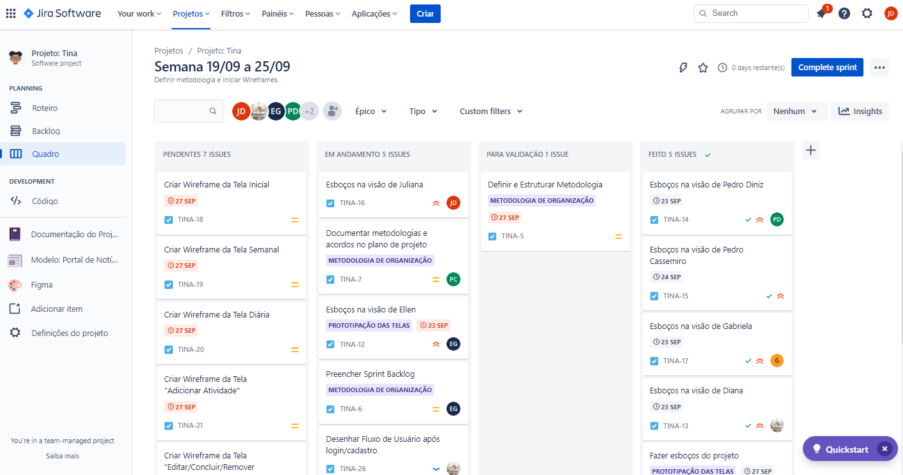

# Metodologia

A metodologia abaixo descreve a definição das plataformas e métodos utilizados pela equipe para a geração de artefatos. As definições foram realizadas quanto aos ambientes de trabalho e às plataformas de gerenciamento de projeto e organização e distribuição de tarefas.

## Relação de Ambientes de Trabalho

Os diversos ambientes de trabalho e suas respectivas plataformas estão descritos abaixo: 

|Ambiente| Plataforma |Link de Acesso|
|:--------------------:|:------------------------------------:|:----------------------------------------:|
|Repositório de Código Fonte| <i>GitHub</i> |[GitHub - TINA](https://github.com/ICEI-PUC-Minas-PMV-ADS/pmv-ads-2022-2-e1-proj-web-t5-tina)|
|Documentos do Projeto| <i>Documentos Google</i> |[Documentos Google - Projeto TINA](https://docs.google.com/document/d/1xgnERUmhhSl95Wog4cSZbBEcOPh9F8ONZzdEDbVb40k/edit)|
|Projeto de Interface e <i>Wireframes</i>| <i>Figma</i> |[Figma - Projeto TINA](https://www.figma.com/file/8fLcvqzsQxmqe885hzJItd/Tina?node-id=0%3A1)|
|Gerenciamento do Projeto| <i>Jira</i> |[Jira - Projeto TINA](https://projetotina.atlassian.net/jira/software/projects/TINA/boards/2)|

## Gerenciamento de Projeto
A equipe definiu a metodologia ágil <i>Scrum</i> para gerenciar o processo de desenvolvimento do projeto. As iterações, <i>Sprints</i>, serão de 1 semana. A cada semana ocorrerá uma reunião de planejamento da <i>Sprints</i>, na qual será definida os <i>backlogs</i> do produto que serão os <i>backlogs</i> da próxima <i>Sprints</i>. Reuniões diárias serão realizadas para reportar o que será feito, o que está sendo feito e dificuldades para o <i>Scrum Master</i>. Ao final da <i>Sprints</i>, uma reunião de revisão é realizada para avaliar se o artefato produzido atende os requisitos. Os integrantes da equipe e seus respectivos papéis estão a seguir:
 
* <i>Scrum Master</i>: Será um papel rotativo, a cada semana um novo <i>Scrum Master</i> será escolhido para atuar durante a <i>Sprints</i>.
* <i>Product Owner</i>: Será um papel rotativo, a cada semana um novo <i>Product Owner</i> será escolhido para atuar durante a <i>Sprints</i>.
* Equipe de Desenvolvimento: deve executar as tarefas e participar ativamente das rotinas. Será formada por todos os integrantes da equipe.
  - Diana Santiago Oliveira dos Santos
  - Ellen Caroline Trindade Gonçalves Cândido
  - Gabriela Vitoria Pereira
  - Juliana Dutra Moreira
  - Pedro Henrique Diniz Luiz
  - Pedro Mota Cassemiro

A equipe definiu a ferramenta <i>Jira</i> como plataforma para o gerenciamento de projeto e organização e distribuição de tarefas. A estruturação da plataforma está a seguir:
* <i>Backlog</i>:
  - <i>Backlog</i> do Produto: Lista de todos os requisitos do produto. Essa lista é categorizada de acordo com cada tópico presente nesta documentação.
  - <i>Backlog</i> da <i>Sprints</i>: Lista dos requisitos do produto que serão incorporados à <i>Sprints</i> seguinte. É a lista presente em “Painel”.
* Painel:
  - Pendentes: Lista de <i>Backlogs</i> da <i>Sprints</i> prontos para serem atribuídos e iniciados.
  - Em andamento: Lista de <i>Backlogs</i> da <i>Sprints</i> em desenvolvimento.
  - Para validação: Lista de <i>Backlogs</i> da <i>Sprints</i> aguardando avaliação para conclusão.
  - Feito: Lista de <i>Backlogs</i> validados e finalizados.
* Roteiro:
  - Acompanhamento da projeção temporal das atividades.

As tarefas serão organizadas entre os membros da equipe de modo que cada membro se atribui a tarefa. O quadro <i>Kanban</i>, presente em “Quadro”, está abaixo:

