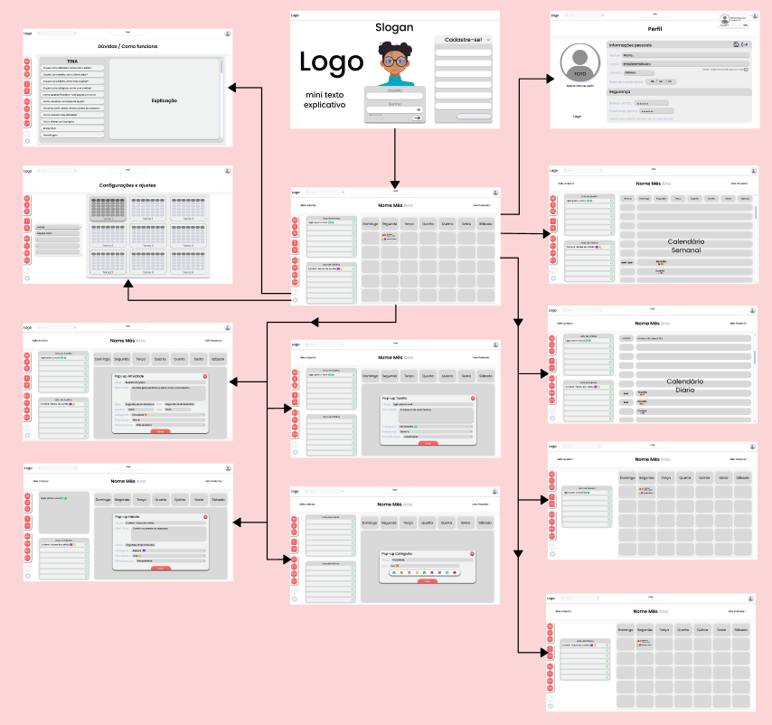
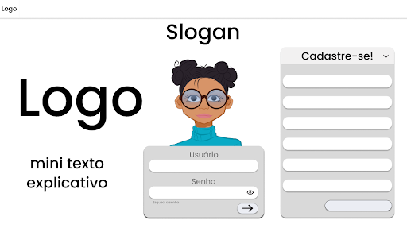

# Projeto de Interface

A interface do sistema foi definida para atender aos requisitos funcionais e cumprir normas e padrões estabelecidos através dos requisitos não funcionais. A padronização dos componentes de tela foi desenvolvida para o sistema ser responsivo, otimizando a sua visualização em diferentes browsers e em conexões web estabelecidas a partir de diferentes hardwares. Além disso, agilidade e acessibilidade também foram guias para as definições de telas e design.

## Fluxo do Usuário

O fluxo de interação do usuário foi desenvolvido a partir da ferramenta Figma. O fluxo de interação pelas diversas telas do sistema é descrito a seguir:

## Wireframes
A estrutura padrão presente nas telas é descrita em detalhes a seguir:

<b>Tela - HomePage/login</b>

A tela Homepage/login será a tela inicial do usuário ao acessar a página. Nesta tela haverá uma pequena descrição da ferramenta, logo e slogan. É nesta tela que o usuário fará o login para acessar sua conta, ou então, criar sua conta.

<b>Tela Inicial - Visão calendário</b>
A tela Visão Calendário apresenta o calendário na visão do mês vigente com as atividades incluídas naquele mês. Além disso, na lateral esquerda, há um campo para tarefas sem prazo e outro campo para acompanhar os hábitos inseridos pelo usuário. O usuário tem a possibilidade de ocultar a barra de tarefa e/ou a de hábitos no menu principal, localizado na lateral esquerda.
O bloco da Barra Superior traz quatro elementos distintos:
● 	componente de pesquisa que permite buscar os compromissos com o resultado da busca solicitada pelo usuário;
● 	componente Hoje que leva o usuário para a tela de Visão Mensal do mês vigente;
● 	componente Mês Anterior que leva o usuário para a tela de Visão Mensal no mês anterior ao vigente;
● 	componente Mês Posterior que leva o usuário para a tela de Visão Mensal no mês posterior ao vigente;

Figura 4: Tela Inicial na visão calendário (mensal) com o menu lateral e lista de tarefas e hábitos
 
<b>Tela - Visão semanal</b>
O usuário consegue alternar a visão de período, podendo escolher entre a visão mensal, semanal ou diária no menu principal. Na Visão Semanal, é possível ver, criar e editar as tarefas, atividades e hábitos da semana, além disso, permite ao usuário visualizar as atividades de cada dia da semana por horário.

Figura 5: Tela Visão Semanal
 
<b>Tela - Visão diária</b>
Já na Visão diária é possível ver, criar e editar todas as atividades, tarefas e hábitos na visão do dia vigente. Nesta função, o usuário poderá ter a visão diária de seus planejamentos por horários definidos.

Figura 6: Tela Visão Diária
 
<b>Tela - Criar uma tarefa, atividade, hábito ou categoria</b>
No menu lateral também é possível inserir uma atividade, tarefa, hábito ou categoria, no qual o botão para criar estes itens está representado pela letra inicial de cada um no menu. No modo de criação da atividade, o usuário insere as informações como título, descrição, data e hora. Na atividade, serão selecionadas também etiquetas de prioridade da tarefa e categoria da atividade, além de permitir a periodização desta atividade. Por fim, ao criar este item ele ficará exibido no calendário.

 
<b>Tela - Perfil</b>
Na tela de Perfil o usuário pode visualizar seu perfil, editar seu cadastro e suas preferências.

Figura 11: Tela Perfil

