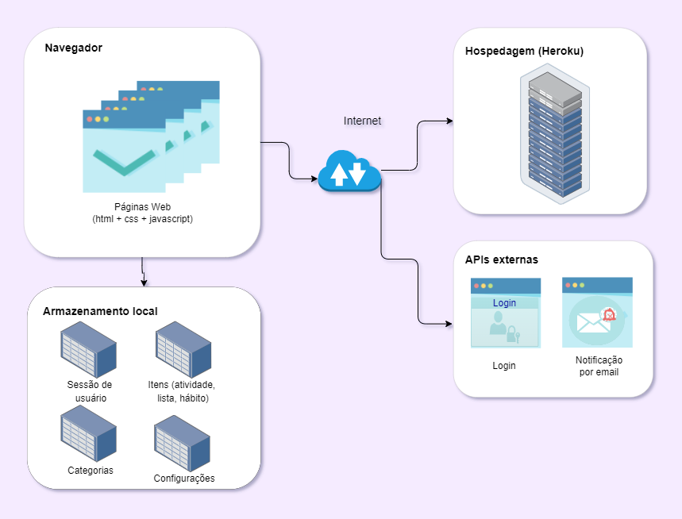

# Arquitetura da Solução

Neste tópico, são mostrados os detalhes técnicos da estrturação do software com seus componetes da solução e do ambiente de hospedagem da aplicação.

## Diagrama de componentes

Os componetes e as conexões entre si estão representados na figura a seguir: 

  

A solução implementada conta com os seguintes módulos:

- <b>Navegador</b>: Interface básica do sistema 
  - <b>Páginas Web</b> - Conjunto de arquivos HTML, CSS, JavaScript e imagens que implementam as funcionalidades do sistema.
  - <b>APIs de Login</b> - serviços que permitem rápido cadastro e login do usuário por contas pré-existentes em outros sistemas.
  - <b>API de comunicação email</b> - serviço que permite o envio de informações e notificações por email. 
  - <b>Armazenamento Local</b> - armazenamento mantido no Navegador do usuário, onde são armazenados dados baseados em JSON. São eles:
    - <b>Sessão de usuário</b> -  informações de login do usuário.
    - <b>Atividade</b> - itens adicionados com informação de data e hora cuja visualização está no calendário. 
    - <b>Lista</b> - itens adicionados a uma lista de organização sem data definida.
    - <b>Hábito</b> - itens adicionados para acompanhamento diário da execução.
    - <b>Categorias</b> - marcadores de organização criados pelo usuário.
- <b>Hospedagem</b> - local  na  Internet  onde  as  páginas  são  mantidas  e  acessadas  pelo navegador. 

## Tecnologias Utilizadas

- Linguagens utilizadas para desenvolver o projeto: HTML, CSS, JavaScript.
- IDEs de desenvolvimento: Visual Studio Code.
- Plataforma para hospedagem do site: Heroku.
- Plataforma para repositório dos arquivos: GitHub.
- Ferramenta de versionamento: Git.
- Ferramenta para a criação de logo e imagens: Canva.
- Ferramenta para crição de template: Figma.

## Hospedagem

A plataforma Heroku foi escolhida por prover um ambiente em nuvem para hospedar, manter e disponibilizar o site do projeto, que pode ser acessado através da URL: 
https://projeto-tina.herokuapp.com 
A publicação do site no Heroku se dá através de um vínculo entre a plataforma e o repositório de arquivos, encontrado no link:
https://git.heroku.com/projeto-tina
As atualizações ao sistema são disponibilizadas por submissões do projeto via git a plataforma.
