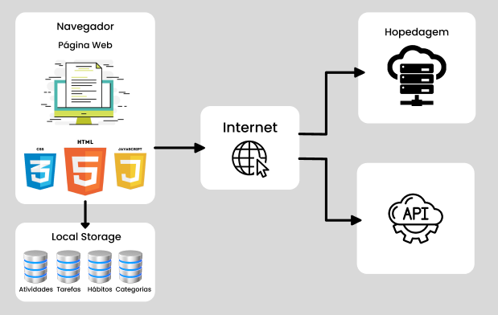

# Arquitetura da Solução

Neste tópico, são mostrados os detalhes técnicos da estrturação do software com seus componetes da solução e do ambiente de hospedagem da aplicação.

## Diagrama de componentes

Os componetes e as conexões entre si estão representados na figura a seguir: 

  

A solução implementada conta com os seguintes módulos:

- <b>Navegador</b>: Interface básica do sistema 
  - <b>Páginas Web</b> - Conjunto de arquivos HTML, CSS, JavaScript e imagens que implementam as funcionalidades do sistema.
  - <b>Local Storage</b> - armazenamento mantido no Navegador
    - <b>Atividades</b> - 
    - <b>Tarefas</b> (?) -
    - <b>Hábitos</b> - 
    - <b>Categorias</b> - 
- <b>News API</b> - plataforma que permite o acesso às notícias exibidas no site.
- <b>Hospedagem</b> - local  na  Internet  onde  as  páginas  são  mantidas  e  acessadas  pelo navegador. 

## Tecnologias Utilizadas

- Linguagens utlizadas para desenvolver o projeto: HTML, CSS, JavaScript
- IDEs de desenvolvimento: Visual Studio Code
- Plataforma para hospedagem do site: Heroku
- Plataforma para hospedagem dos arquivos: GitHub
- Ferramenta de versionamento: Git
- Ferramenta para a criação de logo e imagens: Canva
- Ferramenta para crição de template: Figma

## Hospedagem

