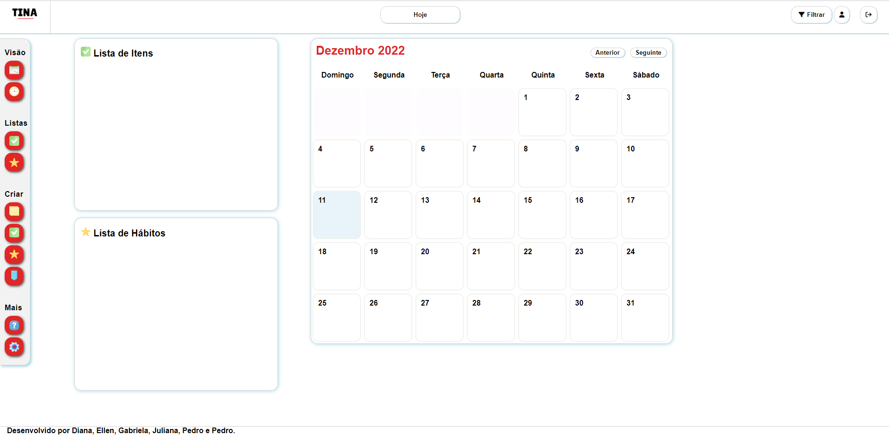

# Template padrão do site

A elaboração do design e a disposição dos elementos baseou-se no modelo feito anteriormente no Figma. Para fornecer responsividade ao layout da página usou-se o recurso de <i>Media query</i> para adequar os padrões a diferentes tamanhos de telas. Além disso, o menu de opções foi concentrado em um único botão para telas de tamanho a baixo de 600px para adequar melhor as ferramentas e visualizações da tela como um todo para o usuário.

## Tela Inicial

  A tela inicial possui um modelo de fundo claro com um cabeçalho no qual, inicialmente a esquerda, é possível acessar a logo do site, seguido pelo botão hoje localizado ao centro do cabeçalho inicial, e no canto direito deste mesmo cabeçalho, as opções de filtro e acesso ao perfil. Logo a baixo do cabeçalho inicial há o cabeçalho do calendário com as opções de acessar o mês antetorir ou posteiror nos cantos opostos deste cabeçalho, e ao centro, a data vigente marcada no calendário pelo usuário. No canto esquerdo da página encontra-se o menu principal com as opções de criação, exibição, listas, ferramentas e ajuda. Ao centro da página encontram-se as listas e o calendário que ocupa a maioria deste espaço para uma melhor visão de todos os elementos aplicados ao calendário do usuário. Ao final, na parte inferior, há um rodapé com as informações pertinentes ao site e aos criadores.
  
  

  

