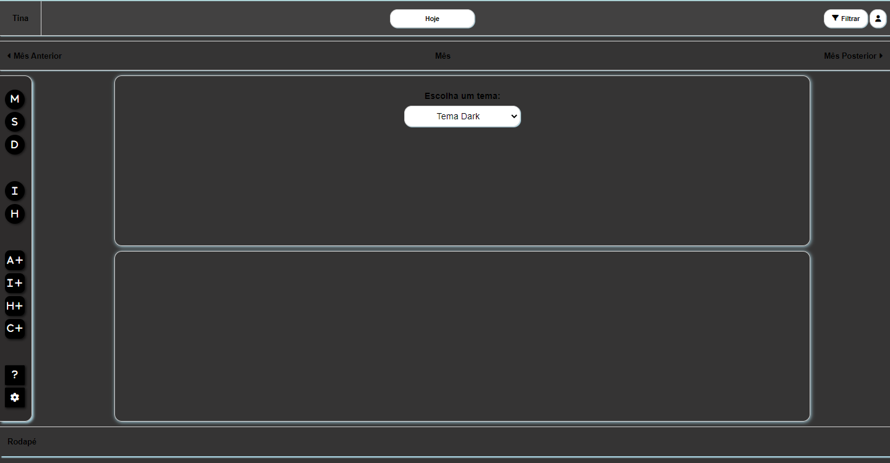

# Programação de Funcionalidades
  As telas desenvolvidas para cada funcionalidade do sistema são exibidas neste tópico. O endereço pode ser acessado no seguitne link: (link)


Nesta seção são apresentadas as funcionalidades do sistema.

## Criação de Atividade (RF-01)
### Desenvolvedor(a): Pedro Mota Cassemiro

O modal de criação de atividade apresenta os campos a serem preenchidos pelo usuário. Os campos são: Título, descrição, data inicial, data final, horário inicial, horário final, categoria, prioridade e periodização. A fim de tornar as atividades únicas, o título deve ser único e atua como um identificador da atividade criada. Ao tentar incluir uma atividade com o mesmo título, um alerta é exibido pelo browser sinalizando que já há atividade registrada no banco com o mesmo título. Todos os campos possuem preenchimento obrigatório, caso algum deles não seja preenchido, seu contorno se torna destacado em vermelho e a atividade não é armazenada no Local Storage. Ao concluir a ação, ou cancelá-la, fechando o modal, todos os campos são reiniciados e preparados para uma nova inserção de dados.


Na imagem é possível observar, em Local Storage, duas atividades já criadas. A segunda, de índice 1, é expandida e apresenta todos os seus campos e valores. Na janela de "Nova Atividade", à esquerda, está um exemplo de atividade com seus campos preenchidos, prestes a ser criada.

### Requisitos atendidos

RF-01 - O site deve permitir que o usuário crie atividades, associe os cadastros a unidades de tempo no calendário e os classifique quanto ao âmbito e nível de prioridade.

### Artefatos da funcionalidade

- tela inicial+criacoes.html
- scripts.js
- tela inicial+criacoes.css
- logo.png
- favicon.ico
- /Images

```js
const titulo = document.getElementById('titulo')
const descricao = document.getElementById('descricao')
const dataInicio = document.getElementById('data-inicio')
const dataFim = document.getElementById('data-fim')
const horarioInicio = document.getElementById('horario-inicio')
const horarioFinal = document.getElementById('horario-final')
const categoria = document.getElementById('categoria')
const prioridade = document.getElementById('prioridade')
const periodizacao = document.getElementById('periodizacao')

const campos = [titulo, descricao, dataInicio, dataFim, horarioInicio, horarioFinal, categoria, prioridade, periodizacao]

const getDados = () => JSON.parse(localStorage.getItem("dbAtividade")) ?? [];
const setDados = (dbAtividade) => localStorage.setItem("dbAtividade", JSON.stringify(dbAtividade));

const criarAtividade = (atividade) => {
    const dbAtividade = getDados();
    dbAtividade.push(atividade);
    setDados(dbAtividade)
}

const limparCampos = () => {
    const inputs = document.querySelectorAll('form input')
    inputs.forEach(input => input.value = '')

    const textareas = document.querySelectorAll('form textarea')
    textareas.forEach(textarea => textarea.value = '')

    const selects = document.querySelectorAll('form select')
    selects.forEach(select => select.value = '')
}

const limparErros = () => {
    titulo.classList.remove('campo-vazio')
    descricao.classList.remove('campo-vazio')
    dataInicio.classList.remove('campo-vazio')
    dataFim.classList.remove('campo-vazio')
    horarioInicio.classList.remove('campo-vazio')
    horarioFinal.classList.remove('campo-vazio')
    categoria.classList.remove('campo-vazio')
    prioridade.classList.remove('campo-vazio')
    periodizacao.classList.remove('campo-vazio')
}

const isDadosValidos = (atividade) => {

    const atividades = getDados()
    var controlador = 0;
    var validade = true
    atividades.forEach(dadoAtividade => {

        if (dadoAtividade.titulo == atividade.titulo) {
            controlador++
        }
    });

    if (controlador != 0) {
        validade = false
        alert('Já existe atividade com o mesmo título registrada.')
    }
    return validade       
}

const salvarAtividade = () => {
    var camposVazios = 0;

    campos.forEach(campo => {
        if (campo.value == '') {
            campo.classList.add('campo-vazio')
            camposVazios++
        } else {
            campo.classList.remove('campo-vazio')
        }
    });

    if (camposVazios == 0) {
        const atividade = {
            titulo: titulo.value,
            descricao: descricao.value,
            dataInicio: dataInicio.value,
            dataFim: dataFim.value,
            horarioInicio: horarioInicio.value,
            horarioFinal: horarioFinal.value,
            categoria: categoria.value,
            prioridade: prioridade.value,
            periodizacao: periodizacao.value
        }
        if (isDadosValidos(atividade)) {
            criarAtividade(atividade)
        }
        onOff('atividade')
    }
}

document.getElementById('criar-atividade')
    .addEventListener('click', salvarAtividade)
```

### Instruções de acesso

No menu lateral, deve-se clicar no botão de criar atividade, com o ícone de bloco de notas. Uma janela irá aparecer no centro da tela e terá os campos a serem preenchidos pelo usuário para registrar a atividade no Local Storage. Ao terminar de preencher todos os campos, deve-se clicar no botão “Criar”.

## Criação, leitura e exclusão Categorias (RF-01)
Desenvolvedor(a): Diana Santiago Oliveira dos Santos

A criação das categorias permite que os usuários categorizem por âmbito suas atividades, itens e hábitos. 

<p align = "center">
  
</p>

## Artefatos da funcionalidade

- tela inicial+criacoes.html
- scripts.js
- tela inicial+criacoes.css
- nova_categoria.png

#### Estrutura dos dados 

```js
const titulo_categoria =  document.getElementById('titulo')
const cor_categoria =  document.getElementById('cor-categoria')

const getCategoria = () => JSON.parse(localStorage.getItem("dbCategoria")) ?? [];
const setCategoria = (dbCategoria) => localStorage.setItem("dbCategoria", JSON.stringify(dbCategoria));

const criarCategoria = (categoria) => {
    const dbCategoria = getDados();
    dbCategoria.push(categoria);
    setDados(dbCategoria)
}
```


## Visualização Mensal do calendário (RF-02)
Desenvolvedor(a): Pedro Henrique Diniz Luiz


A Visualização Mensal conta com um botão funcional que exibe o calandário com as atividades do mês criadas pelo usuário   
## Requisitos atendidos

RF-02 O site deve apresentar, em sua página inicial, um calendário do ano corrente com as atividades criadas e permitir a alteração da visualização do calendário para diferentes períodos de tempo

### Artefatos da funcionalidade

- visao-mensal.html
- visao-mensal.css
- visao-mensal.js
- mensal.js
- perfil-sem-foto-220615.png

#### Estrutura dos dados 

``` function toggle(el) {
    var display = document.getElementById(el).style.display;
    if(display == "none"){
        document.getElementById(el).style.display = 'block';
    }
    else{
        document.getElementById(el).style.display = 'none';
    }
}
```

## Tela Criação de itens e hábitos (RF-08, RF-03, RF-09) 
Desenvolvedor(a): Ellen Caroline Trindade Gonçalves Cândido

## Criação de atividades (RF-01, RF-09)
Desenvolvedor(a): Pedro Mota Cassemiro

## Notificação e resumos por email (RF-006)
Desenvolvedor(a): Gabriela Vitoria Pereira

## Alteração de design do site (RF-011)
### Desenvolvedor(a): Juliana Dutra Moreira

A tela de temas permite que o usuário escolha um tema de desing específico para aplicar em todo o site durante o uso do sistema, permitindo que este tema se mantenha durante todo o acesso ao site.



### Requisitos atendidos

RF-11 - O site deve possibilitar edições de design como mudanças de cores, plano de fundo e adesivos.

### Artefatos da funcionalidade

- template-cores-tina.html.html
- template-cores-tina.js
- template-cores-tina.css
- tema-dark.css
- tema-padrao.css
- logo.png
- favicon.ico

```js
        function initThemeSelector() {
            const themeSelect = document.getElementById("themeSelect");
            const themeStylesheetLink = document.getElementById("themeStylesheetLink");
            const currentTheme = localStorage.getItem("theme") || "tema-padrao";

            function ativarTema(themeName) {
                themeStylesheetLink.setAttribute("href", `temas/${themeName}.css`);
            }
            themeSelect.addEventListener("change", () => {
                ativarTema(themeSelect.value);
                localStorage.setItem("theme", themeSelect.value);
            });

            ativarTema(currentTheme);
            themeSelect.value = currentTheme;
```

### Instruções de acesso

A Tela perfil é acessada ao usuário acessar o botão ferramentas no menu lateral.

## Criação de Itens e hábitos (RF-03, RF-08)
### Desenvolvedor(a): Ellen Caroline Trindade Gonçalves Cândido

O modal de criação de itens apresenta os campos a serem preenchidos pelo usuário.  Os campos são: Título, descrição, categoria, prioridade
O modal de criação de hábitos apresenta os campos a serem preenchidos pelo usuário.Os campos são: Título, descrição, data inicial, data final, categoria, prioridade e periodização. Todos os campos possuem preenchimento obrigatório. Ao concluir a ação, ou cancelá-la, fechando o modal, nenhum item ou hábito é criado e o histórico do último é mantido para futura consulta. Ao selecionar "Criar", o item ou hábito é criado e inserido em sua respectiva lista.


Na imagem é possível observar duas atividades os modais para criação das atividades. Na imagem a seguir, são mostra os itens e hábitos já criados.


### Requisitos atendidos

RF-03 - O site deve permitir que o usuário crie itens em uma lista não associada a unidades de tempo no calendário 
RF-08 - O site deve permitir que o usuário crie e associe anotações de hábitos ao calendário


### Artefatos da funcionalidade
 
- tela inicial+criacoes.html
- scripts.js
- tela inicial+criacoes.css
- logo.png
- favicon.ico
- /Images

```js
function onOff(type) {
    if (type == "atividade") {
        document
            .querySelector("#modal-atividade")
            .classList
            .toggle("hide")
        document
            .querySelector("#modal-atividade")
            .classList
            .toggle("addScroll")
    }
    else if(type == "item"){
        document
            .querySelector("#modal-item")
            .classList
            .toggle("hide")
        document
            .querySelector("#modal-item")
            .classList
            .toggle("addScroll")
        
    }
    else if (type == "habito"){
        document
            .querySelector("#modal-habito")
            .classList
            .toggle("hide")
        document
            .querySelector("#modal-habito")
            .classList
            .toggle("addScroll")
    }
}

var btnCriarItem = document.querySelector("#btn-criar-item");

btnCriarItem.addEventListener("click", function(event){
    event.preventDefault();

    var formItem = document.querySelector("#form-item");
    var item = {
        "nome": formItem.titulo.value,
        "descricao": formItem.descricao.value,
        "categoria": formItem.categoria.value,
        "prioridade": formItem.prioridade.value
    }
    
    var listaItens = document.querySelector(".lista-itens");
    var novoItem = document.createElement("div");
    novoItem.innerHTML = "Nome: " + item.nome + "<br>Descrição: "+ item.descricao + "<br>Categoria: " + item.categoria + "      Prioridade: " + item.prioridade ;


    listaItens.appendChild(novoItem);
    onOff("item");
})

var btnCriarHabito = document.querySelector("#btn-criar-habito");

btnCriarHabito.addEventListener("click", function(event){
    event.preventDefault();
    
    var formHabito = document.querySelector("#form-habito");
    var habito = {
        "nome": formHabito.titulo.value,
        "descricao": formHabito.descricao.value,
        "data_inicio": formHabito['data-inicio'].value,
        "data_fim" : formHabito['data-fim'].value,
        "categoria": formHabito.categoria.value,
        "prioridade": formHabito.prioridade.value,
        "periodizacao": formHabito.periodizacao.value
    }
    
    var listaHabitos = document.querySelector(".lista-habitos");
    var novoHabito = document.createElement("div");
    novoHabito.innerHTML = "Nome: " + habito.nome + "<br>Descrição: "+ habito.descricao + "<br>De: "+ habito.data_inicio + "  até  : "+ habito.data_fim + "<br>Categoria: " + habito.categoria + "      Prioridade: " + habito.prioridade + "<br>Periodização: "+ habito.periodizacao;


    listaHabitos.appendChild(novoHabito);
    onOff("habito");
})
```

### Instruções de acesso

Para criar item, no menu lateral, deve-se clicar no botão de criar item, com o ícone de checkbox. Uma janela irá aparecer no centro da tela e terá os campos a serem preenchidos pelo usuário para registrar o item no Local Storage e aparecer na lista. Ao terminar de preencher todos os campos, deve-se clicar no botão “Criar”.
Já para criar hábito, no menu lateral novamente, deve-se clicar no botão de criar hábito, destacado pelo ícone de estrela. Uma janela irá aparecer no centro da tela e terá os campos a serem preenchidos pelo usuário para registrar o hábito no Local Storage e aparecer na lista. Ao terminar de preencher todos os campos, deve-se clicar no botão “Criar”.
