# Programação de Funcionalidades
  As telas desenvolvidas para cada funcionalidade do sistema são exibidas neste tópico. O endereço pode ser acessado no seguitne link: (link)


Nesta seção são apresentadas as funcionalidades do sistema.

## Criação de Atividade (RF-01)
### Desenvolvedor(a): Pedro Mota Cassemiro

O modal de criação de atividade apresenta os campos a serem preenchidos pelo usuário. Os campos são: Título, descrição, data inicial, data final, horário inicial, horário final, categoria, prioridade e periodização. A fim de tornar as atividades únicas, o título deve ser único e atua como um identificador da atividade criada. Ao tentar incluir uma atividade com o mesmo título, um alerta é exibido pelo browser sinalizando que já há atividade registrada no banco com o mesmo título. Todos os campos possuem preenchimento obrigatório, caso algum deles não seja preenchido, seu contorno se torna destacado em vermelho e a atividade não é armazenada no Local Storage. Ao concluir a ação, ou cancelá-la, fechando o modal, todos os campos são reiniciados e preparados para uma nova inserção de dados.

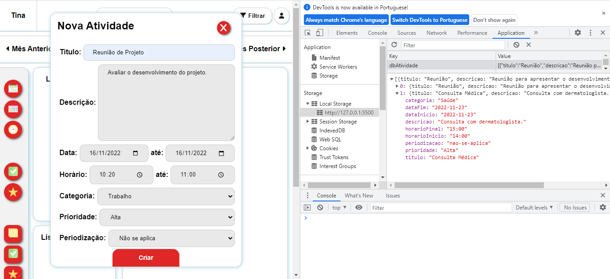

Na imagem é possível observar, em Local Storage, duas atividades já criadas. A segunda, de índice 1, é expandida e apresenta todos os seus campos e valores. Na janela de "Nova Atividade", à esquerda, está um exemplo de atividade com seus campos preenchidos, prestes a ser criada.

### Requisitos atendidos

RF-01 - O site deve permitir que o usuário crie atividades, associe os cadastros a unidades de tempo no calendário e os classifique quanto ao âmbito e nível de prioridade.

### Artefatos da funcionalidade

- home.html
- scripts.js
- criar-atividade.js
- inserirAtividadeCalendario.js
- inserirAtividadeDiario.js
- home.css
- logo.png
- favicon.ico
- /Images

```js
// CRUD - Criar Atividade

const titulo = document.getElementById('titulo')
const descricao = document.getElementById('descricao')
const dataInicio = document.getElementById('data-inicio')
const dataFim = document.getElementById('data-fim')
const horarioInicio = document.getElementById('horario-inicio')
const horarioFinal = document.getElementById('horario-final')
const categoria = document.getElementById('categoria')
const prioridade = document.getElementById('prioridade')
const periodizacao = document.getElementById('periodizacao')

const campos = [titulo, descricao, dataInicio, dataFim, horarioInicio, horarioFinal, categoria, prioridade, periodizacao]

const getDados = () => JSON.parse(localStorage.getItem("dbAtividade")) ?? [];
const setDados = (dbAtividade) => localStorage.setItem("dbAtividade", JSON.stringify(dbAtividade));

const criarAtividade = (atividade) => {
    const dbAtividade = getDados();
    dbAtividade.push(atividade);
    setDados(dbAtividade)
}

const limparCampos = () => {
    const inputs = document.querySelectorAll('form input')
    inputs.forEach(input => input.value = '')

    const textareas = document.querySelectorAll('form textarea')
    textareas.forEach(textarea => textarea.value = '')

    const selects = document.querySelectorAll('form select')
    selects.forEach(select => select.value = '')
}

const limparErros = () => {
    titulo.classList.remove('campo-vazio')
    descricao.classList.remove('campo-vazio')
    dataInicio.classList.remove('campo-vazio')
    dataFim.classList.remove('campo-vazio')
    horarioInicio.classList.remove('campo-vazio')
    horarioFinal.classList.remove('campo-vazio')
    categoria.classList.remove('campo-vazio')
    prioridade.classList.remove('campo-vazio')
    periodizacao.classList.remove('campo-vazio')
}

const isDadosValidos = (atividade) => {

    const atividades = getDados()
    var controlador = 0;
    var validade = true
    atividades.forEach(dadoAtividade => {

        if (
          dadoAtividade.titulo.toUpperCase() == atividade.titulo.toUpperCase()
        ) {
          controlador++;
        }
    });

    if (controlador != 0) {
        validade = false
        alert('Já existe atividade com o mesmo título registrada.')
    }
    return validade
}

const salvarAtividade = () => {
    var camposVazios = 0;

    campos.forEach(campo => {
        if (campo.value == '') {
            campo.classList.add('campo-vazio')
            camposVazios++
        } else {
            campo.classList.remove('campo-vazio')
        }
    });  

    if (camposVazios == 0) {
        const atividade = {
            titulo: titulo.value,
            descricao: descricao.value,
            dataInicio: dataInicio.value,
            dataFim: dataFim.value,
            horarioInicio: horarioInicio.value,
            horarioFinal: horarioFinal.value,
            categoria: categoria.value,
            prioridade: prioridade.value,
            periodizacao: periodizacao.value
        }
        if (isDadosValidos(atividade)) {
            criarAtividade(atividade)
            load();
            onOff('atividade')
        }
    }
}

document.getElementById('criar-atividade')
    .addEventListener('click', salvarAtividade)
```

### Instruções de acesso

No menu lateral, deve-se clicar no botão de criar atividade, com o ícone de bloco de notas. Uma janela irá aparecer no centro da tela e terá os campos a serem preenchidos pelo usuário para registrar a atividade no Local Storage. Ao terminar de preencher todos os campos, deve-se clicar no botão “Criar”.

## Criação, leitura e exclusão Categorias (RF-01)
Desenvolvedor(a): Diana Santiago Oliveira dos Santos

A criação das categorias permite que os usuários categorizem por âmbito suas atividades, itens e hábitos. 

<p align = "center">
  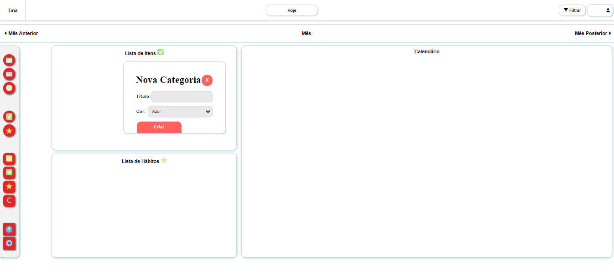
</p>

## Artefatos da funcionalidade

- tela inicial+criacoes.html
- teste_categoria.js
- tela inicial+criacoes.css
- nova_categoria.png

#### Estrutura dos dados 

```js
const openModal = () => document.getElementById('modal')
    .classList.add('active')

const closeModal = () => {
    clearFields()
    document.getElementById('modal').classList.remove('active')
}


const getLocalStorage = () => JSON.parse(localStorage.getItem('db_categoria')) ?? []
const setLocalStorage = (dbCategoria) => localStorage.setItem("db_categoria", JSON.stringify(dbCategoria))

// CRUD - create read update delete
const deleteCategoria = (index) => {
    const dbCategoria = readCategoria()
    dbCategoria.splice(index, 1)
    setLocalStorage(dbCategoria)
}

const updateCategoria = (index, adCategoria) => {
    const dbCategoria = readCategoria()
    dbCategoria[index] = adCategoria
    setLocalStorage(dbCategoria)
}

const readCategoria = () => getLocalStorage()

const createCategoria = (adCategoria) => {
    const dbCategoria = getLocalStorage()
    dbCategoria.push(adCategoria)
    setLocalStorage(dbCategoria)
}

const isValidFields = () => {
    return document.getElementById('form').reportValidity()
}

//Interação com o layout

const clearFields = () => {
    const fields = document.querySelectorAll('.modal-field')
    fields.forEach(field => field.value = "")
    document.getElementById('nome').dataset.index = 'new'
}

const saveCategoria = () => {
    if (isValidFields()) {
        var codigo = document.getElementById('cor').value

        if (codigo == 'Azul') {
            codigo = "rgb(173, 216, 230)";
        }
        else if (codigo == 'Rosa') {
            codigo = "rgb(255, 182, 193)";
        }
        else if (codigo == 'Vermelho') {
            codigo = "rgb(240, 128, 128)";
        }
        else if (codigo == 'Verde') {
            codigo = "rgb(183, 213, 172)";
        }
        else if (codigo == 'Amarelo') {
            codigo = "rgba(239, 221, 122, 0.814)";
        }

        const adCategoria = {
            nome: document.getElementById('nome').value,
            cor: document.getElementById('cor').value,
            codigo: codigo
        }

        const index = document.getElementById('nome').dataset.index
        if (index == 'new') {
            createCategoria(adCategoria)
            updateTable()
            closeModal()
        } else {
            updateCategoria(index, adCategoria)
            updateTable()
            closeModal()
        }
    }
    window.location.reload()
}

const createRow = (adCategoria, index) => {
    const newRow = document.createElement('tr')
    newRow.innerHTML = `
        <td>${adCategoria.nome}</td>
        <td class="nota">${adCategoria.cor}</td>
        <td>
            <button type="button" class="button green" id="edit-${index}">Editar</button>
            <button type="button" class="button red" id="delete-${index}" >Excluir</button>
        </td>
    `
    document.querySelector('#tableClient>tbody').appendChild(newRow)
}

const clearTable = () => {
    const rows = document.querySelectorAll('#tableClient>tbody tr')
    rows.forEach(row => row.parentNode.removeChild(row))
}

const updateTable = () => {
    const dbCategoria = readCategoria()
    clearTable()
    dbCategoria.forEach(createRow)
}

const fillFields = (adCategoria) => {
    document.getElementById('nome').value = adCategoria.nome
    document.getElementById('cor').value = adCategoria.cor
    document.getElementById('nome').dataset.index = adCategoria.index
}

const editCategoria = (index) => {
    const adCategoria = readCategoria()[index]
    adCategoria.index = index
    fillFields(adCategoria)
    openModal()
}

const editDelete = (event) => {
    if (event.target.type == 'button') {

        const [action, index] = event.target.id.split('-')

        if (action == 'edit') {
            editCategoria(index)
        } else {
            const adCategoria = readCategoria()[index]
            const response = confirm(`Deseja realmente excluir essa categoria ${adCategoria.nome}`)
            if (response) {
                deleteCategoria(index)
                updateTable()
            }
        }
    }
}

updateTable()

//document.getElementById('modalClose')
//    .addEventListener('click', closeModal)

document.getElementById('salvar')
    .addEventListener('click', saveCategoria)

document.querySelector('#tableClient>tbody')
    .addEventListener('click', editDelete)

document.getElementById('cancelar')
    .addEventListener('click', closeModal)

document.querySelector('#tableClient>tbody')
    .addEventListener('click', condicional)

document.getElementById('salvar')
    .addEventListener('click', condicional)

// mudando a cor do option categoria

var select = document.getElementById('cor');
select.onchange = function () {
    select.className = this.options[this.selectedIndex].className;
}

// mudando a cor da categoria na tabela de edição 
function condicional() {
    var tds = document.getElementsByTagName("td");
    var i;
    for (i = 0; i < tds.length; i++) {
        if (tds[i].innerHTML == 'Azul') {
            tds[i].style.backgroundColor = "rgb(173, 216, 230)";
        }
        else if (tds[i].innerHTML == 'Rosa') {
            tds[i].style.backgroundColor = "rgb(255, 182, 193)";
        }
        else if (tds[i].innerHTML == 'Vermelho') {
            tds[i].style.backgroundColor = "rgb(240, 128, 128)";
        }
        else if (tds[i].innerHTML == 'Verde') {
            tds[i].style.backgroundColor = "rgb(183, 213, 172)";
        }
        else if (tds[i].innerHTML == 'Amarelo') {
            tds[i].style.backgroundColor = "rgba(239, 221, 122, 0.814)";
        }
    }
}

// tornando a escolha da categoria (option)
const categoriaList = getLocalStorage()
const categoriaSelect = document.getElementById("categoria");
for (o in categoriaList) {
    option = new Option(categoriaList[o].nome, categoriaList[o].nome);
    option.style.backgroundColor = categoriaList[o].codigo;
    categoriaSelect.options[categoriaSelect.options.length] = option;
}

const categoriaSelecti = document.getElementById("item-categoria");
if (categoriaSelecti) {
    for (o in categoriaList) {
        option = new Option(categoriaList[o].nome, categoriaList[o].nome);
        option.style.backgroundColor = categoriaList[o].codigo;
        categoriaSelecti.options[categoriaSelecti.options.length] = option;
    }
}

const categoriaSelecth = document.getElementById("habito-categoria");
if (categoriaSelecth) {
    for (o in categoriaList) {
        option = new Option(categoriaList[o].nome, categoriaList[o].nome);
        option.style.backgroundColor = categoriaList[o].codigo;
        categoriaSelecth.options[categoriaSelecth.options.length] = option;
    }
}

const categoriaSelecta = document.getElementById("atualizar-categoria");
if (categoriaSelecta) {
    for (a in categoriaList) {
        option = new Option(categoriaList[a].nome, categoriaList[a].nome);
        option.style.backgroundColor = categoriaList[a].codigo;
        categoriaSelecta.options[categoriaSelecta.options.length] = option;
    }
}

const categoriaSelectFiltro = document.getElementById("filtro");
if (categoriaSelectFiltro) {
    for (a in categoriaList) {
        option = new Option(categoriaList[a].nome, categoriaList[a].nome);
        option.style.backgroundColor = categoriaList[a].codigo;
        categoriaSelectFiltro.options[categoriaSelectFiltro.options.length] = option;
    }
}
```

## Visualização Mensal do calendário (RF-02)
### Desenvolvedor(a): Pedro Mota Cassemiro e Pedro Henrique Diniz Luiz

A Visualização Mensal apresenta os meses do ano e seus dias, além de disponibilizar espaço para a apresentaçao das atividades criadas pelo usuário. As atividades são vinculadas aos dias do calendário de acordo com a data inicial estabelecida no momento da criação da mesma.  

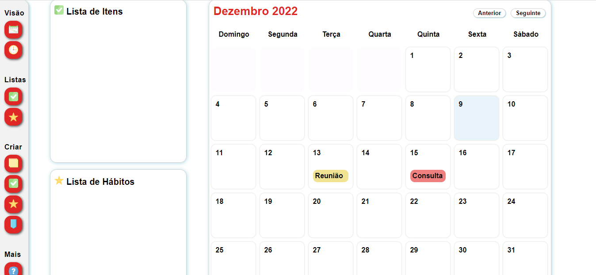

Na imagem é possível observar a apresentação mensal do calendário. No topo há o nome do mês, seguido pelo ano, e dois botões à direita que permitem a navegação pelos meses. O dia atual é destacado na cor azul claro.

## Requisitos atendidos

RF-02 - O site deve apresentar, em sua página inicial, um calendário do ano corrente com as atividades criadas e permitir a alteração da visualização do calendário para diferentes períodos de tempo.

### Artefatos da funcionalidade

- home.html
- home.css
- calendarioMensal.js
- inserirAtividadeCalendario.js
- logo.png
- favicon.ico
- /Images

### Estrutura dos dados 

``` js
let nav = 0;
let clicked = null;

const calendar = document.getElementById('calendar');
const weekdays = ['Sunday', 'Monday', 'Tuesday', 'Wednesday', 'Thursday', 'Friday', 'Saturday'];

function load() {
    const dt = new Date();

    if (nav !== 0) {
        dt.setMonth(new Date().getMonth() + nav);
    }

    const day = dt.getDate();
    const month = dt.getMonth();
    const year = dt.getFullYear();

    const firstDayOfMonth = new Date(year, month, 1);
    const daysInMonth = new Date(year, month + 1, 0).getDate();

    const dateString = firstDayOfMonth.toLocaleDateString('en-us', {
        weekday: 'long',
        year: 'numeric',
        month: 'numeric',
        day: 'numeric',
    });
    const paddingDays = weekdays.indexOf(dateString.split(', ')[0]);

    document.getElementById('monthDisplay').innerText =
        `${dt.toLocaleDateString('pt-br', { month: 'long' })} ${year}`;

    calendar.innerHTML = '';

    for (let i = 1; i <= paddingDays + daysInMonth; i++) {
        const daySquare = document.createElement('div');
        daySquare.classList.add('day');

        const dayString = `${year}-${month < 9 ? '0' : ''}${month + 1}-${(i - paddingDays) < 10 ? '0' : ''}${i - paddingDays}`;

        if (i > paddingDays) {
            daySquare.innerText = i - paddingDays;

            inserirAtividades(dayString, daySquare);

            if (i - paddingDays === day && nav === 0) {
                daySquare.id = 'currentDay';
            }

        } else {
            daySquare.classList.add('padding');
        }

        calendar.appendChild(daySquare);
    }
}

function initButtons() {
    document.getElementById('nextButton').addEventListener('click', () => {
        nav++;
        load();
    });

    document.getElementById('backButton').addEventListener('click', () => {
        nav--;
        load();
    });

    document.getElementById('botao-hoje').addEventListener('click', () => {
        nav = 0;
        load();
    });
}

exibirListaItens()
exibirListaHabitos()
initButtons();
load();
```

### Instruções de acesso

O calendário mensal é a exibição padrão e já estará disponível na página principal. Para navegar pelos meses, basta utilzar os botões "anterior" e "seguinte", localizados no canto superior direito do calendário. Para retornar para o mês atual, deve-se utilizar o botão "Hoje", localizado no centro superior da página.

## Visualização Diária do calendário (RF-02)
### Desenvolvedor(a): Pedro Mota Cassemiro e Juliana Dutra Moreira

A Visualização Diária apresenta os dias do ano e uma escala de tempo, com intervalo de 30 minutos, que vai de 00:00 a 23:30. Além disso, disponibiliza espaço para a apresentaçao das atividades criadas pelo usuário. As atividades são vinculadas aos dias e horários do calendário de acordo com a data inicial e horário inicial estabelecidos no momento da criação da mesma.

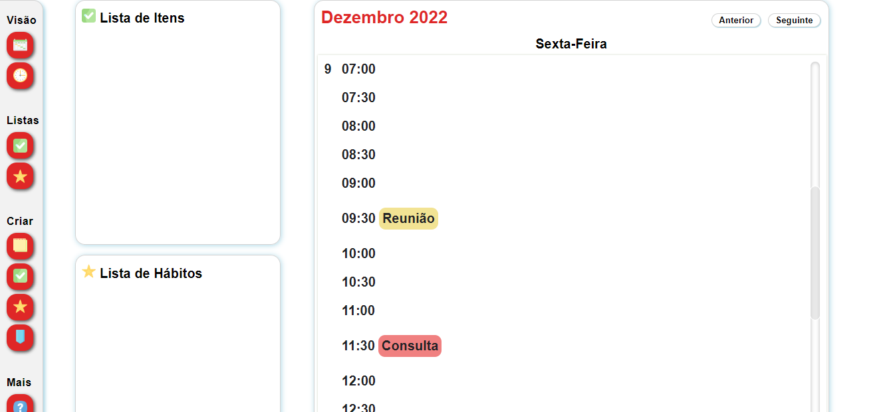

Na imagem é possível observar a apresentação diária do calendário. No topo há o nome do mês, seguido pelo ano, e dois botões à direita que permitem a navegação pelos dias.

## Requisitos atendidos

RF-02 - O site deve apresentar, em sua página inicial, um calendário do ano corrente com as atividades criadas e permitir a alteração da visualização do calendário para diferentes períodos de tempo.

### Artefatos da funcionalidade

- home-calendario-diario.html
- home.css
- calendarioDiario.js
- inserirAtividadeDiario.js
- logo.png
- favicon.ico
- /Images

### Estrutura dos dados

```js
let nav = 0;

const calendar = document.getElementById("calendar");
const diaSemana = document.getElementById("dia-semana");
const weekday = document.createElement("div");
let diaDaSemana = "";
const intervaloHorarios = [
  "00:00",
  "00:30",
  "01:00",
  "01:30",
  "02:00",
  "02:30",
  "03:00",
  "03:30",
  "04:00",
  "04:30",
  "05:00",
  "05:30",
  "06:00",
  "06:30",
  "07:00",
  "07:30",
  "08:00",
  "08:30",
  "09:00",
  "09:30",
  "10:00",
  "10:30",
  "11:00",
  "11:30",
  "12:00",
  "12:30",
  "13:00",
  "13:30",
  "14:00",
  "14:30",
  "15:00",
  "15:30",
  "16:00",
  "16:30",
  "17:00",
  "17:30",
  "18:00",
  "18:30",
  "19:00",
  "19:30",
  "20:00",
  "20:30",
  "21:00",
  "21:30",
  "22:00",
  "22:30",
  "23:00",
  "23:30",
];

function load() {
  const dt = new Date();

  if (nav !== 0) {
    dt.setDate(new Date().getDate() + nav);
  }

  const day = dt.getDate();
  const month = dt.getMonth();
  const year = dt.getFullYear();

  document.getElementById("monthDisplay").innerText = `${dt.toLocaleDateString(
    "pt-br",
    { month: "long" }
  )} ${year}`;

  calendar.innerHTML = "";

  const daySquare = document.createElement("div");
  daySquare.classList.add("dayDiario");

  daySquare.innerText = day;

  const dayString = `${year}-${month < 9 ? "0" : ""}${month + 1}-${
    day < 10 ? "0" : ""
  }${day}`;

  daySquare.id = "currentDayDiario";

  const horarios = document.createElement("div");
  horarios.id = "horarios";

  intervaloHorarios.forEach((horario) => {
    const intervalo = document.createElement("span");
    intervalo.setAttribute("id", horario);
    intervalo.innerText = horario;
    horarios.appendChild(intervalo);
    let idIntervalo = intervalo.id;
    inserirAtividadeDiario(dayString, intervalo, idIntervalo);
  });

  weekday.classList.add("weekday");
  diaDaSemana = dt.toLocaleDateString("pt-br", {
    weekday: "long",
  });

  weekday.innerText = diaDaSemana;

  calendar.appendChild(daySquare);
  diaSemana.appendChild(weekday);
  daySquare.appendChild(horarios);
}

function initButtons() {
  document.getElementById("nextButton").addEventListener("click", () => {
    nav++;
    load();
  });

  document.getElementById("backButton").addEventListener("click", () => {
    nav--;
    load();
  });

  document.getElementById("botao-hoje").addEventListener("click", () => {
    nav = 0;
    load();
  });
}

exibirListaItens();
exibirListaHabitos();

initButtons();
load();
```

### Instruções de acesso

O calendário mensal é a exibição padrão e já estará disponível na página principal. Para acessar a visualização diária, deve-se acionar o botão de visualização diária, com o ícone de relógio, no menu lateral esquerdo. Para navegar pelos dias, basta utilzar os botões "anterior" e "seguinte", localizados no canto superior direito do calendário. Para retornar para o dia atual, deve-se utilizar o botão "Hoje", localizado no centro superior da página.

## Edição e Exclusão de Atividade (RF-04, RF-05)
### Desenvolvedor(a): Pedro Mota Cassemiro

O modal de edição de atividade apresenta os campos preenchidos com os dados da atividade a ser editada. Os campos são: Título, descrição, data inicial, data final, horário inicial, horário final, categoria, prioridade e periodização. O título ainda deve ser único e continua atuando como um identificador da atividade editada. O alerta exibido pelo browser, sinalizando que já há atividade registrada no banco com o mesmo título, ainda é apresentada caso essa regra seja violada no momento de edição. Todos os campos continuam necessitando preenchimento obrigatório, caso algum deles não seja preenchido, seu contorno se torna destacado em vermelho e a atividade não é armazenada no Local Storage. Ao excluir a atividade selecionada, a mesma é apagada do registro no Local Storage. Por se tratar de uma alteração irreversível, uma mensagem de confirmação é apresentada pelo browser ao usuário. Caso a resposta seja afirmativa, a ação é concluída, caso seja negativa, nenhuma alteração é realizada.

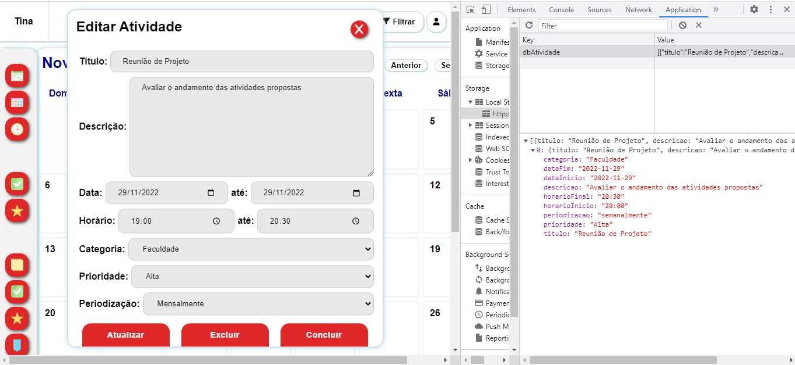

Na imagem é possível observar, em Local Storage, Uma atividade já criada. À esquerda, está o modal de edição, apresentado as alterações feitas, em horário inicial, horário final e periodização. Também é possível observar, além do botão de edição, os botões de exclusão e conclusão.

### Requisitos atendidos

RF-04 - O site deve permitir que as atividades sejam editadas, inclusive entre as unidades de tempo no calendário.<br>
RF-05 - O site deve permitir que o usuário sinalize uma atividade como finalizada ou cancelada.

### Artefatos da funcionalidade

- home.html
- scripts.js
- atualizarAtividade.js
- home.css
- logo.png
- favicon.ico
- /Images

```js
// CRUD - atualizar Atividade

var atividadeASerAtualizada;
var atividadeASerExcluida;
var index = 0

const tituloEditado = document.getElementById('atualizar-titulo')
const descricaoEditado = document.getElementById('atualizar-descricao')
const dataInicioEditado = document.getElementById('atualizar-data-inicio')
const dataFimEditado = document.getElementById('atualizar-data-fim')
const horarioInicioEditado = document.getElementById('atualizar-horario-inicio')
const horarioFinalEditado = document.getElementById('atualizar-horario-final')
const categoriaEditado = document.getElementById('atualizar-categoria')
const prioridadeEditado = document.getElementById('atualizar-prioridade')
const periodizacaoEditado = document.getElementById('atualizar-periodizacao')

const intervaloHorariosDiarios = [
  "00:00",
  "00:30",
  "01:00",
  "01:30",
  "02:00",
  "02:30",
  "03:00",
  "03:30",
  "04:00",
  "04:30",
  "05:00",
  "05:30",
  "06:00",
  "06:30",
  "07:00",
  "07:30",
  "08:00",
  "08:30",
  "09:00",
  "09:30",
  "10:00",
  "10:30",
  "11:00",
  "11:30",
  "12:00",
  "12:30",
  "13:00",
  "13:30",
  "14:00",
  "14:30",
  "15:00",
  "15:30",
  "16:00",
  "16:30",
  "17:00",
  "17:30",
  "18:00",
  "18:30",
  "19:00",
  "19:30",
  "20:00",
  "20:30",
  "21:00",
  "21:30",
  "22:00",
  "22:30",
  "23:00",
  "23:30",
];

const camposEditados = [tituloEditado, descricaoEditado, dataInicioEditado, dataFimEditado, horarioInicioEditado, horarioFinalEditado, categoriaEditado, prioridadeEditado, periodizacaoEditado]

const preencherCamposModal = (atividadeASerAtualizada) => {

    document.querySelector("#atualizar-titulo").value = atividadeASerAtualizada.titulo
    document.querySelector("#atualizar-descricao").value = atividadeASerAtualizada.descricao
    document.querySelector("#atualizar-data-inicio").value = atividadeASerAtualizada.dataInicio
    document.querySelector("#atualizar-data-fim").value = atividadeASerAtualizada.dataFim
    document.querySelector("#atualizar-horario-final").value = atividadeASerAtualizada.horarioFinal
    document.querySelector("#atualizar-horario-inicio").value = atividadeASerAtualizada.horarioInicio
    document.querySelector("#atualizar-categoria").value = atividadeASerAtualizada.categoria
    document.querySelector("#atualizar-prioridade").value = atividadeASerAtualizada.prioridade
    document.querySelector("#atualizar-periodizacao").value = atividadeASerAtualizada.periodizacao

}

const abrirModalUpdateExcluir = (event) => {

    if (event.target.id != "" && event.target.id != "calendar" && event.target.id != "currentDay" && event.target.id != "currentDayDiario" && event.target.id != "horarios" && !intervaloHorariosDiarios.includes(event.target.id)) {
        onOff('atualizar-atividade')    

        getDados().forEach(atividade => {

            if (atividade.titulo == event.target.id) {

                index = getDados().findIndex(atividade => {
                    return atividade.titulo == event.target.id
                })
                atividadeASerAtualizada = getDados()[index]
                preencherCamposModal(atividadeASerAtualizada)
            }
        });
    }
}

const limparErrosEdicao = () => {
    tituloEditado.classList.remove('campo-vazio')
    descricaoEditado.classList.remove('campo-vazio')
    dataInicioEditado.classList.remove('campo-vazio')
    dataFimEditado.classList.remove('campo-vazio')
    horarioInicioEditado.classList.remove('campo-vazio')
    horarioFinalEditado.classList.remove('campo-vazio')
    categoriaEditado.classList.remove('campo-vazio')
    prioridadeEditado.classList.remove('campo-vazio')
    periodizacaoEditado.classList.remove('campo-vazio')
}

function isSameAtividade(atividadeAtualizada) {

    var valido = true
    var indexAtividade = 0
    getDados().forEach(atividade => {
        
       if ((atividade.titulo == atividadeAtualizada.titulo) && (index != indexAtividade)) {
            valido = false
            alert('Já existe atividade cadastrada com o título inserido.')
        }

        indexAtividade++

    });
    return valido
}

const atualizarAtividade = (atividadeAtualizada) => {
    
    const dbAtividade = getDados()
    dbAtividade[index] = atividadeAtualizada
    setDados(dbAtividade)
}

const salvarAtividadeAtualizada = () => {
    var camposVazios = 0;

    camposEditados.forEach(campo => {
        if (campo.value == '') {
            campo.classList.add('campo-vazio')
            camposVazios++
        } else {
            campo.classList.remove('campo-vazio')
        }
    });

    if (camposVazios == 0) {
        const atividadeAtualizada = {
            titulo: tituloEditado.value,
            descricao: descricaoEditado.value,
            dataInicio: dataInicioEditado.value,
            dataFim: dataFimEditado.value,
            horarioInicio: horarioInicioEditado.value,
            horarioFinal: horarioFinalEditado.value,
            categoria: categoriaEditado.value,
            prioridade: prioridadeEditado.value,    
            periodizacao: periodizacaoEditado.value
        }   

        if (isSameAtividade(atividadeAtualizada)) {
            atualizarAtividade(atividadeAtualizada)
            load();
            onOff('atualizar-atividade')
        }
    }
}

// Excluir Atividade

const excluirAtividade = () => {
    let confirmacao = confirm('Realmente deseja excluir a atividade selecionada? A ação não pode ser desfeita.')
    if (confirmacao) {
        const dbAtividade = getDados()
        dbAtividade.splice(index, 1)
        setDados(dbAtividade)
        load()
        onOff('atualizar-atividade')
    } else {
        onOff('atualizar-atividade')
    }

}

const concluirAtividade = () => {

    const partesData = dataFimEditado.value.split('-')
    const dataFormatada = new Date(partesData[0], partesData[1] - 1, partesData[2], 0, 0, 0, 0)
    const dataAtual = new Date()
    const anoAtual = dataAtual.getFullYear()
    const mesAtual = dataAtual.getMonth()
    const diaAtual = dataAtual.getDate()
    const dataAtualString = `${anoAtual}-${mes < 9 ? '0' : '' }${mesAtual + 1}-${diaAtual < 10 ? '0' : ''}${diaAtual}`
    const partesDataAtual = dataAtualString.split('-')
    const dataAtualNoTime = new Date(partesDataAtual[0], partesDataAtual[1] - 1, partesDataAtual[2], 0, 0, 0, 0)
    
    if (dataFormatada >= dataAtualNoTime) {
        new Audio('parabenizacao.mp3').play()
        const dbAtividade = getDados()
        dbAtividade.splice(index, 1)
        setDados(dbAtividade)
        load()
        onOff('atualizar-atividade')
    }
}

document.querySelector('#calendar')
    .addEventListener('click', abrirModalUpdateExcluir)

document.querySelector('#atualizar')
    .addEventListener('click', salvarAtividadeAtualizada)

document.querySelector("#excluir")
    .addEventListener('click', excluirAtividade)

document.querySelector("#concluir")
    .addEventListener('click', concluirAtividade)
```

### Instruções de acesso

No calendário, deve-se clicar na atividade que se deseja editar. Uma janela irá aparecer no centro da tela e terá os campos já preenchidos com os dados da atividade selecionada. Ao terminar de preencher todos os campos, deve-se clicar no botão “Atualizar”. Caso o usuário deseje excluir a atividade, deve-se clicar no botão "Excluir" e confirmar a ação no alerta que aparecerá no browser.

## Notificação e resumos por email (RF-06)
Desenvolvedor(a): Gabriela Vitoria Pereira


## Tooltips (RF-10)
### Desenvolvedor(a): Juliana Dutra Moreira

Os tooltips auxiliam o usúario por meio explicações resumidas sobre o conteúdo ou funcionalidade dos itens que ele esta interagindo.

Exemplo do tooltip sendo exibido ao colocar o cursos no botão "Seguinte" do calendário.
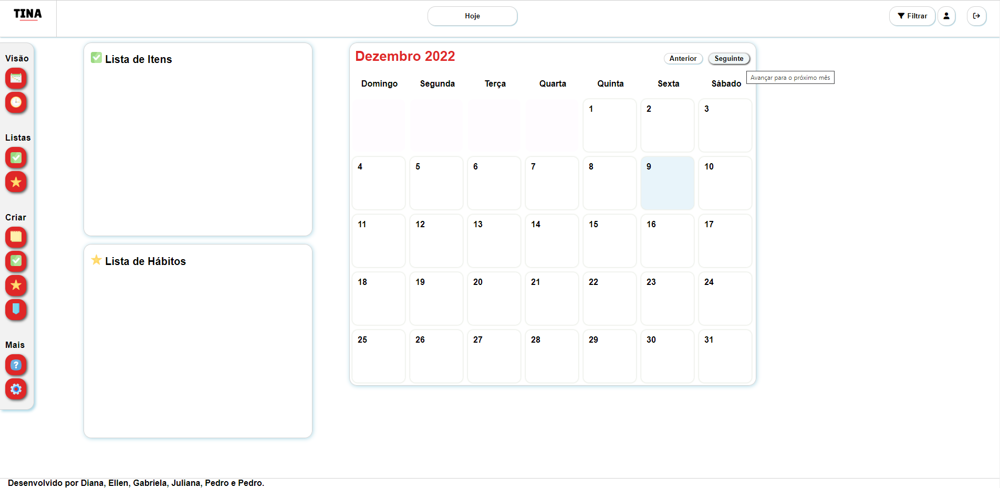

### Requisitos atendidos

RF-10 - O site deve apresentar tooltips para facilitar o uso.

### Artefatos da funcionalidade

- cadastro.html
- configurações.html
- duvidas.html
- home-calendario-diario.html
- home.html
- login.html
- perfil.html

### Instruções de acesso

Para visualizar os tooltips o usuário deve posicionar o cursor em cima do item que deseja interagir, então, uma pequena caixa aparecerá com o resumo explicativo.

## Alteração de estilização do site (RF-11)
### Desenvolvedor(a): Juliana Dutra Moreira

A tela de temas permite que o usuário escolha um tema de desing específico para aplicar em todo o site, permitindo que este tema se mantenha durante todo o acesso ao site. É possível alterar as cores e os ícones dos itens do menu lateral.

Opções do menu drop-down que exibe as opções de temas para o usuário:
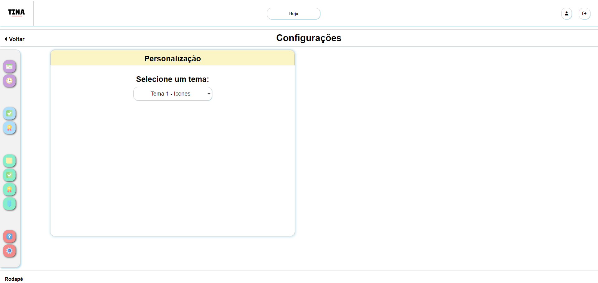

Aplicação do tema escolhido no calendário:
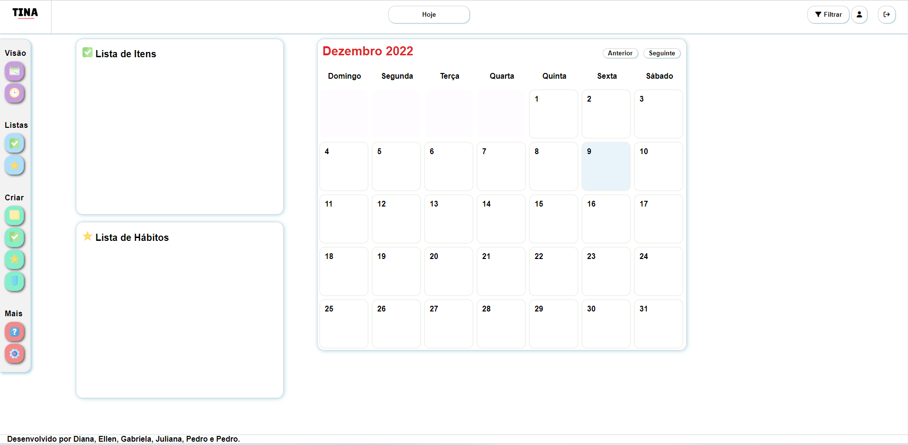

### Requisitos atendidos

RF-11 - O site deve possibilitar edições de design como mudanças de cores, plano de fundo e adesivos.

### Artefatos da funcionalidade

- configurações.html
- configurações.js
- configurações.css
- tema-dark.css
- tema-icones-dark.css
- tema-padrao.css
- tema-icones
- tema1.css
- tema1-icones.css
- tema2.css
- tema2-icones.css
- tema3.css
- tema3-icones.css
- logo.png
- favicon.ico

```js
window.onload=function(){

function initThemeSelector() {
    const themeSelect = document.getElementById("themeSelect");
    const themeStylesheetLink = document.getElementById("themeStylesheetLink");
    const currentTheme = localStorage.getItem("theme") || "tema-padrao";

    function ativarTema(themeName) {
        themeStylesheetLink.setAttribute("href", `temas/${themeName}.css`);
    }
    themeSelect.addEventListener("change", () => {
        ativarTema(themeSelect.value);
        localStorage.setItem("theme", themeSelect.value);
    });

    ativarTema(currentTheme);
    themeSelect.value = currentTheme;
}

initThemeSelector();
}
```

### Instruções de acesso

Para acessar esta funcionalidade o usuário deve selecionar o icóne de ferramentas no menu lateral de criações.

## Criação de Itens e hábitos (RF-03, RF-08)
### Desenvolvedor(a): Ellen Caroline Trindade Gonçalves Cândido

O modal de criação de itens apresenta os campos a serem preenchidos pelo usuário.  Os campos são: Título, descrição, categoria, prioridade
O modal de criação de hábitos apresenta os campos a serem preenchidos pelo usuário.Os campos são: Título, descrição, data inicial, data final, categoria, prioridade e periodização. Todos os campos possuem preenchimento obrigatório. Ao concluir a ação, ou cancelá-la, fechando o modal, nenhum item ou hábito é criado. Ao selecionar "Criar", o item ou hábito é criado e inserido em sua respectiva lista.

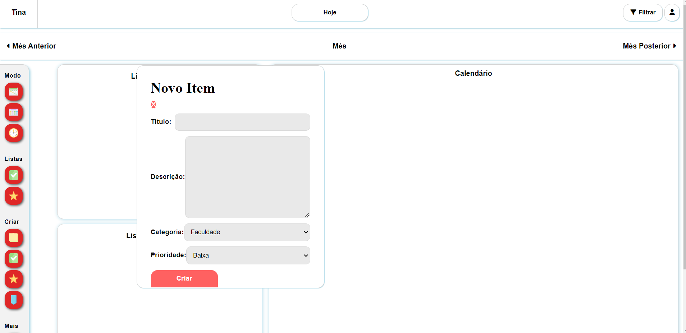


Na imagem é possível observar duas atividades os modais para criação das atividades. Na imagem a seguir, são mostra os itens e hábitos já criados.
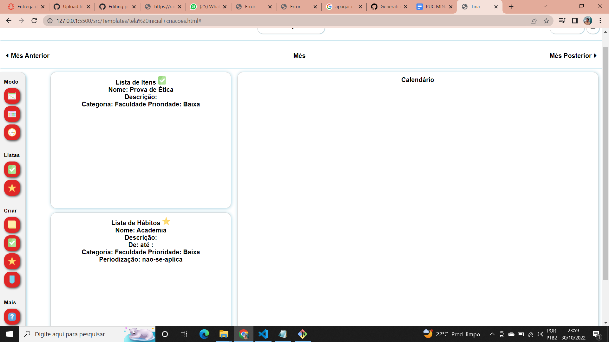

### Requisitos atendidos

RF-03 - O site deve permitir que o usuário crie itens em uma lista não associada a unidades de tempo no calendário 
RF-08 - O site deve permitir que o usuário crie e associe anotações de hábitos ao calendário


### Artefatos da funcionalidade
 
- tela inicial+criacoes.html
- scripts.js
- tela inicial+criacoes.css
- logo.png
- favicon.ico
- /Images
```js
const getDadosItem = () => JSON.parse(localStorage.getItem("dbItens")) ?? [];
const setDadosItem = (dbItens) => localStorage.setItem("dbItens", JSON.stringify(dbItens));

const itemTitulo = document.getElementById('item-titulo')
const itemDescricao = document.getElementById('item-descricao')
const itemCategoria = document.getElementById('item-categoria')
const itemPrioridade = document.getElementById('item-prioridade')

const inputsItem = [itemTitulo, itemDescricao, itemCategoria, itemPrioridade]

var listaItens = document.querySelector("#todos-itens")
function exibirListaItens() {
    listaItens.classList.toggle("addScroll")

    var divModelo = document.getElementById('cada-item')
    var cadaItem;

    getDadosItem().forEach(elemento => {
        cadaItem = divModelo.cloneNode(true)
        cadaItem.innerHTML = elemento.titulo
        cadaItem.style.display = 'block'
        listaItens.appendChild(cadaItem)
    })
}

function criarItem() {
    const item = {
        titulo: itemTitulo.value.trim(),
        descricao: itemDescricao.value,
        categoria: itemCategoria.value,
        prioridade: itemPrioridade.value
    }

    if (saoDadosValidosEmItem(item)) {
        inserirItem(item)
        onOff("item")
        adicionarUltimoItemEmLista(item.titulo)
    } else {
        alert("Não foi possível salvar. Há campos vazios ou título igual ao de outro item.")
    }
}
```

```js
const getDadosHabito = () => JSON.parse(localStorage.getItem("dbHabitos")) ?? [];
const setDadosHabito = (dbHabitos) => localStorage.setItem("dbHabitos", JSON.stringify(dbHabitos));

const habitoTitulo = document.getElementById('habito-titulo')
const habitoDescricao = document.getElementById('habito-descricao')
const habitoDataInicio = document.getElementById('habito-data-inicio')
const habitoDataFim = document.getElementById('habito-data-fim')
const habitoCategoria = document.getElementById('habito-categoria')
const habitoPrioridade = document.getElementById('habito-prioridade')
const habitoPeriodizacao = document.getElementById('habito-periodizacao')

const inputsHabito = [habitoTitulo, habitoDescricao, habitoDataInicio, habitoDataFim, habitoCategoria, habitoPrioridade, habitoPeriodizacao]

var listaHabitos = document.querySelector("#todos-habitos")
function exibirListaHabitos() {
    listaHabitos.classList.toggle("addScroll")

    var divModelo = document.getElementById('cada-habito')
    var cadaHabito;

    getDadosHabito().forEach(elemento => {
        cadaHabito = divModelo.cloneNode(true)
        cadaHabito.innerHTML = elemento.titulo
        cadaHabito.style.display = 'block'
        listaHabitos.appendChild(cadaHabito)
    })
}

function criarHabito() {
    const habito = {
        titulo: habitoTitulo.value.trim(),
        descricao: habitoDescricao.value,
        dataInicio: habitoDataInicio.value,
        dataFim: habitoDataFim.value,
        categoria: habitoCategoria.value,
        prioridade: habitoPrioridade.value,
        periodizacao: habitoPeriodizacao.value
    }

    if (saoDadosValidosEmHabito(habito)) {
        inserirHabito(habito)
        onOff("habito")
        adicionarUltimoHabitoEmLista(habito.titulo)
    } else {
        alert("Não foi possível salvar. Há campos vazios ou título igual ao de outro hábito.")
    }

}
```


### Instruções de acesso

Para criar item, no menu lateral, deve-se clicar no botão de criar item, com o ícone de checkbox. Uma janela irá aparecer no centro da tela e terá os campos a serem preenchidos pelo usuário para registrar o item no Local Storage e aparecer na lista. Ao terminar de preencher todos os campos, deve-se clicar no botão “Criar”.
Já para criar hábito, no menu lateral novamente, deve-se clicar no botão de criar hábito, destacado pelo ícone de estrela. Uma janela irá aparecer no centro da tela e terá os campos a serem preenchidos pelo usuário para registrar o hábito no Local Storage e aparecer na lista. Ao terminar de preencher todos os campos, deve-se clicar no botão “Criar”.

## Atualização e Remoção de Itens e hábitos (RF-03, RF-08)
### Desenvolvedor(a): Ellen Caroline Trindade Gonçalves Cândido

Ao criar um "Item", uma div o representará na "Lista de Itens" disponível na tela principal. Ao clicar em algum dos elementos, o modal é carregado preenchido com os dados do item na tela com as opções para atualizar ou remover.
Do mesmo modo, ao criar um "Hábito", uma div o representará na "Lista de Hábitos" disponível logo abaixo da lista anterior. Ao clicar em algum dos elementos, é carregado um modal preenchido com suas informações com as opções de atualizar ou remover.
Em ambos os casos, ao clicar em "atualizar", é validado se o título é único e não há nenhum input vazio, caso sim, as informações presentes nos inputs serão atualizadas no armazenamento local e na lista de visualização. Já ao clicar em "remover", uma mensagem de confirmação é disparada, com a confirmação, o elemento selecionado será removido da lista e do armazenamento local.


Na imagem, é possível observar a "lista de Itens" preenchida e o item selecionado disponível para ser atualizado ou removido. Também é possível ver as informações no armazenamento local.


Nesta imagem, é possível observar a "lista de Hábitos" preenchida e o hábito selecionado disponível para ser atualizado ou removido. Também é possível ver as informações no armazenamento local.


### Requisitos atendidos

RF-03 - O site deve permitir que o usuário crie itens em uma lista não associada a unidades de tempo no calendário 
RF-08 - O site deve permitir que o usuário crie e associe anotações de hábitos ao calendário
RF-09 - O site deve possibilitar automação como na criação de regras para periodização de atividades e/ou ações específicas


### Artefatos da funcionalidade
 
- tela inicial+criacoes.html
- scripts.js
- tela inicial+criacoes.css
- logo.png
- favicon.ico
- /Images

```js
function atualizarItem() {
    var indice = getDadosItem().findIndex(e => e.titulo === document.getElementById('idItem').value)
    var db = getDadosItem()
    const novoItem = {
        titulo: itemTitulo.value.trim(),
        descricao: itemDescricao.value,
        categoria: itemCategoria.value,
        prioridade: itemPrioridade.value
    }

    if (saoDadosValidosEmItem(novoItem)) {
        db[indice] = novoItem
        Array.prototype.forEach.call(document.getElementsByClassName("cada-item"), function (divisor) {
            if (divisor.innerText == document.getElementById('idItem').value) {
                divisor.innerText = itemTitulo.value
            }
        });
        setDadosItem(db)
        onOff("item")
    } else {
        alert("Não foi possível salvar. Há campos vazios ou título igual a outro item.")
    }
}

function removerItem() {
    var confirmacao = confirm("Você tem certeza que quer apagar o item '" + idItem.value + "'?")
    if (confirmacao) {
        var indice = getDadosItem().findIndex(e => e.titulo === document.getElementById('idItem').value)
        var db = getDadosItem()
        db.splice(indice, 1)
        setDadosItem(db)
    }
}
```

```js
function atualizarHabito() {
    var indice = getDadosHabito().findIndex(e => e.titulo === document.getElementById('idHabito').value)
    var db = getDadosHabito()
    const novoHabito = {
        titulo: habitoTitulo.value.trim(),
        descricao: habitoDescricao.value,
        dataInicio: habitoDataInicio.value,
        dataFim: habitoDataFim.value,
        categoria: habitoCategoria.value,
        prioridade: habitoPrioridade.value,
        periodizacao: habitoPeriodizacao.value
    }

    if (saoDadosValidosEmHabito(novoHabito)) {
        db[indice] = novoHabito
        Array.prototype.forEach.call(document.getElementsByClassName("cada-habito"), function (divisor) {
            if (divisor.innerText == document.getElementById('idHabito').value) {
                divisor.innerText = habitoTitulo.value
            }
        });
        setDadosHabito(db)
        onOff("habito")
    } else {
        alert("Não foi possível salvar. Há campos vazios ou título igual a outro hábito.")
    }
}

function removerHabito() {
    var confirmacao = confirm("Você tem certeza que quer apagar o hábito '" + idHabito.value + "' ?")
    if (confirmacao) {
        var indice = getDadosHabito().findIndex(e => e.titulo === document.getElementById('idHabito').value)
        var db = getDadosHabito()
        
        db.splice(indice, 1)
        setDadosHabito(db)
    }
}
```

### Instruções de acesso

Para atualizar um Item, clique no item a ser atualizado na "Lista de Itens". Uma janela surgirá com os campos disponíveis com os valores anteriores preenchidos, na qual é possível alterar os conteúdos e clicar em "Atualizar". Para remover o Item, repita o mesmo procedimento para a abertura da janela do elemento escolhido e clique no botão "Remover".
Para atualizar um Hábito, clique no hábito escolhido na "Lista de Hábitos". Uma janela surgirá com os campos disponíveis com os valores anteriores preenchidos, na qual é possível alterar os conteúdos e clicar em "Atualizar". Para remover o Hábito, repita o mesmo procedimento para a abertura da janela do elemento escolhido e clique no botão "Remover".

## Cadastro do usuário (RF-)
### Desenvolvedor(a): Juliana Dutra Moreira

O cadastro permite que o usuário crie sua conta para acessar o site. O usuário preenche os campos de Nome, Email, Senha e Confirmação de senha com diversas validações para a criação correta da conta. As validações vão instruindo o usuário colocar nos campos as informações necessárias conforme os critérios exibidos nas mensagens dos campos do fomulário de cadastro. Após o preenchimento correto o usuário é informado que a conta foi criada e é redirecionado para a tela de login. Caso o e-mail do usuário já tenha sido cadastrado uma mensagem é exibida informando que o e-mail já está cadastrado e se desejar, o usuário deve ir para a página de login ou tentar novamente.

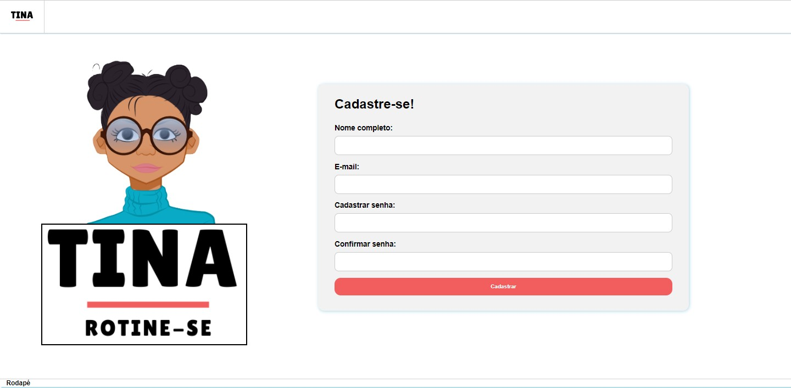

### Requisitos atendidos

Funcionalidade sem requisitos específicos

### Artefatos da funcionalidade

- cadastro.html
- cadastro.css
- cadastro.js
- logo2.png
- logo3.png
- tinaavatar.png
- favicon.ico
- /Images

```js
function salvaCadastro (event) {
    event.preventDefault ();

    // Obtem os dados do formulário
    let nome   = document.getElementById('nome').value;
    let validNome = false

    let email  = document.getElementById('email').value;
    let validEmail = false
    var validEmailRepetido = true 

    let senha  = document.getElementById('senha').value;
    let validSenha = false

    let senha2 = document.getElementById('confirmsenha').value;
   
    if (nome.length <= 4) {
        labelnome.setAttribute('style', 'color: red')
        labelnome.innerHTML = 'Nome completo: *Insira no minimo 5 caracteres'
        validNome = false
    } else {
        labelnome.setAttribute('style', 'color: green')
        validNome = true
    }

    if (email.indexOf(".com", "@") <= 1) {
        labelemail.setAttribute('style', 'color: red')
        labelemail.innerHTML = 'E-mail: *Insira um e-mail válido'
        validEmail = false
    } else {
        labelemail.setAttribute('style', 'color: green')
        validEmail = true
        
        var usuariosJSON = localStorage.getItem('db_usuarios');
        db_usuarios = JSON.parse(usuariosJSON);    
    
        for(var i = 0; i < db_usuarios.usuarios.length; i++) {
            var usuario = db_usuarios.usuarios[i];
  
        var controlador = 0
    
         if (email == usuario.email) {
            controlador++
        } 
    
        if (controlador != 0) {
            alert ('E-mail já cadastrado. Tente novamente ou prossiga para o login');
            validEmailRepetido = false
        }}
    }

    if (senha != senha2) {
        labelSenha.setAttribute('style', 'color: red')
        labelconfirm.setAttribute('style', 'color: red')
        labelconfirm.innerHTML = 'Confirmar Senha *As senhas não conferem'
        validSenha = false
    } else {
        labelconfirm.setAttribute('style', 'color: green')
        labelSenha.setAttribute('style', 'color: green')
        labelconfirm.innerHTML = 'Confirmar Senha *correto'
        validSenha = true
    }

     if ((nome != '' && email != '' && senha != '' && senha2 != '') && (validNome && validEmail && validSenha && validEmailRepetido)) {
        addUser (nome, senha, email);
        alert ('Usuário salvo com sucesso. Proceda com o login');
        window.location.href = 'login.html'
    } else {
        alert("Preencha todos os campos corretamente antes de prosseguir")
    }
}

function acessarTelaLogin() {
    return window.location.href = 'login.html'
}
  document.getElementById('cadastrar').addEventListener('click', salvaCadastro);
  
```

### Instruções de acesso

Na página inicial do login o usuário seleciona o link "cadastre-se" e é encaminahdo para a página do cadastro.

## Login do usuário (RF-)
### Desenvolvedor(a): Juliana Dutra Moreira

O login é a página inicial do site, no qual é possível visualizar a logo, avatar e um texto explicativo sobre o site. O usuário insere nos campos e-mail e senha seus dados de login previamente cadastrados e seleciona o botão "entrar" para acessar o site. Caso, inicialmente, o usuário não tenha cadastro, é possível realizar o cadastro pelo link "Cadastre-se" abaixo do campo "senha". Este mesmo campo possui uma ferramenta que permite o usuário visualizar sua senha clicando no ícone representado por um olho.

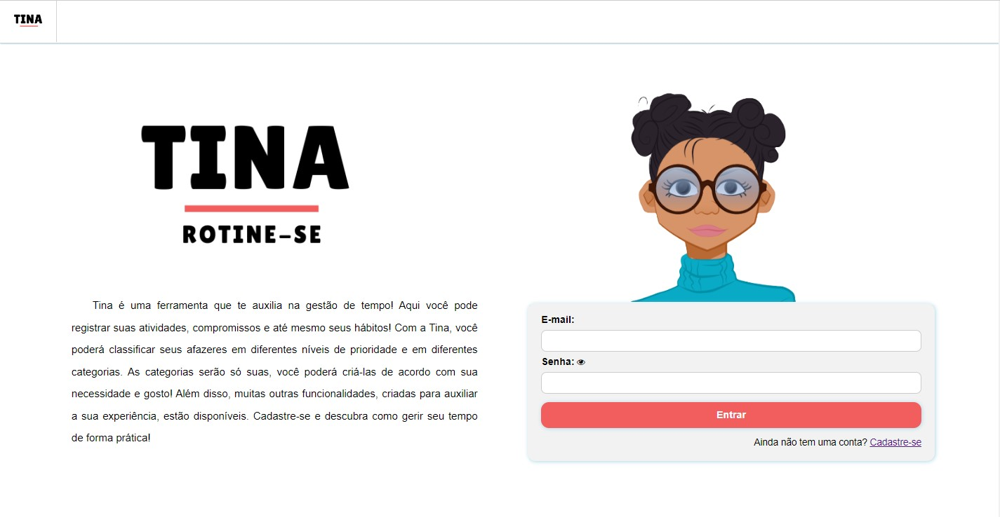

### Requisitos atendidos

Funcionalidade sem requisitos específicos

### Artefatos da funcionalidade

- Login.html
- Login.css
- Login.js
- logo3.png
- tinaavatar.png
- favicon.ico


```js
const LOGIN_URL = "login.html";

var db_usuarios = {};

var usuarioCorrente = {};

function generateUUID() { 
    var d = new Date().getTime();
    var d2 = (performance && performance.now && (performance.now()*1000)) || 0;
    return 'xxxxxxxx-xxxx-4xxx-yxxx-xxxxxxxxxxxx'.replace(/[xy]/g, function(c) {
        var r = Math.random() * 16;
        if(d > 0){
            r = (d + r)%16 | 0;
            d = Math.floor(d/16);
        } else {
            r = (d2 + r)%16 | 0;
            d2 = Math.floor(d2/16);
        }
        return (c === 'x' ? r : (r & 0x3 | 0x8)).toString(16);
    });
}

const dadosIniciais = {
    usuarios: [
        { "id": generateUUID (), "login": "admin", "senha": "123", "nome": "Administrador do Sistema", "email": "admin@abc.com"},
        { "id": generateUUID (), "login": "user", "senha": "123", "nome": "Usuario Comum", "email": "user@abc.com"},
    ]
};

function initLoginApp () {
    usuarioCorrenteJSON = sessionStorage.getItem('usuarioCorrente');
    if (usuarioCorrenteJSON) {
        usuarioCorrente = JSON.parse (usuarioCorrenteJSON);
    }
    
    var usuariosJSON = localStorage.getItem('db_usuarios');

    if (!usuariosJSON) {

        db_usuarios = dadosIniciais;

        localStorage.setItem('db_usuarios', JSON.stringify (dadosIniciais));
    }
    else  {
        db_usuarios = JSON.parse(usuariosJSON);    
    }
};

function loginUser (email, senha) {
    
    for (var i = 0; i < db_usuarios.usuarios.length; i++) {
        var usuario = db_usuarios.usuarios[i];
        
        if (email == usuario.email && senha == usuario.senha) {
            usuarioCorrente.id = usuario.id;
            usuarioCorrente.email = usuario.email;
            usuarioCorrente.senha = usuario.senha;
            usuarioCorrente.nome = usuario.nome;
            
            sessionStorage.setItem ('usuarioCorrente', JSON.stringify (usuarioCorrente));

            console.log(usuarioCorrente.nome)
            console.log(usuarioCorrente.email)
            console.log(usuarioCorrente.senha)
            
            return true
        }
    }
    return false;
}

function addUser (nome, senha, email) {
    
    let newId = generateUUID ();
    let usuario = { "id": newId, "senha": senha, "nome": nome, "email": email };
    
    db_usuarios.usuarios.push (usuario);

    localStorage.setItem('db_usuarios', JSON.stringify (db_usuarios));
}

// function setUserPass () {

// }

function processaFormLogin (event) {                
    event.preventDefault ();

    var email = document.getElementById('email').value;
    var senha = document.getElementById('senha').value;

    resultadoLogin = loginUser (email, senha);
    if (resultadoLogin) {
        window.location.href = 'perfil.html';
    }
    else { // Se login falhou, avisa ao usuário
        alert ('Usuário ou senha incorretos');
    }
}

initLoginApp ();
document.getElementById ('entrar').addEventListener ('click', processaFormLogin);

let btn = document.querySelector('.fa-eye')

btn.addEventListener('click', ()=>{
  let inputSenha = document.querySelector('#senha')
  
  if(inputSenha.getAttribute('type') == 'password'){
    inputSenha.setAttribute('type', 'text')
  } else {
    inputSenha.setAttribute('type', 'password')
  }
})

```

### Instruções de acesso

Para acessar o login o usuário deve acesar o site. Também é possível acessar o login ao clicar na logo, localizada canto superior esquerdo na página do cadastro, e assim também, ao realizar logout.

## Perfil do usuário (RF-)
### Desenvolvedor(a): Juliana Dutra Moreira

O perfil exibe as informações armazenadas no cadastro do usuário e outras funcionalidades como habilitar ou desabilitar o envio de notificações por e-mail e inserir foto.
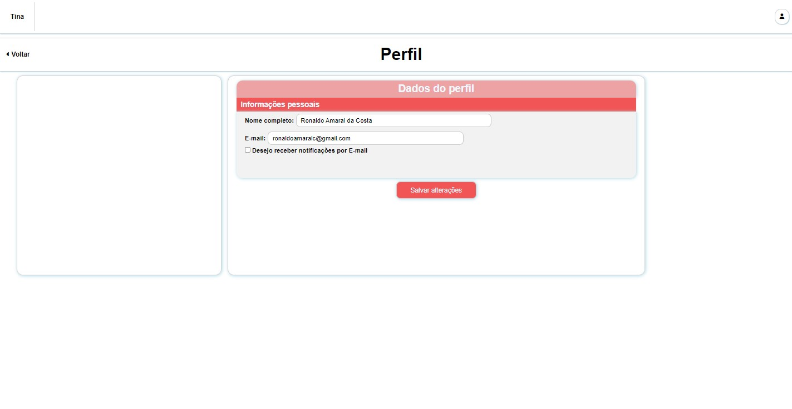
### Requisitos atendidos

Funcionalidade sem requisitos específicos

### Artefatos da funcionalidade

- Perfil.html
- Perfil.css
- Perfil.js
- logo2.png
- favicon.ico
- /Images

```js
function exibeUsuarios() {
    
    document.querySelector("#nome").value = usuarioCorrente.nome
    document.querySelector("#email").value = usuarioCorrente.email
}

function initPage() {
    document.getElementById('btn_logout').addEventListener('click', logoutUser);
    exibeUsuarios ();
}

window.addEventListener('load', initPage);

document.querySelector('#image_input').addEventListener('change', function () {
    const reader = new FileReader()

    reader.addEventListener('load', () => {
        localStorage.setItem("recent-image", reader.result)
    })

    reader.readAsDataURL(this.files[0])
})

document.addEventListener("DOMContentLoaded", () => {
    const recentImageDataUrl = localStorage.getItem("recent-image")
    if (recentImageDataUrl) {
        document.querySelector('#imgPreview').setAttribute('src', recentImageDataUrl)
    }
})

document.querySelector('#salvaFoto').addEventListener('click', function recarregarPagina(){
    window.location.reload();
} )

function logoutUser () {
    usuarioCorrente = {};
    sessionStorage.setItem ('usuarioCorrente', JSON.stringify (usuarioCorrente));
    window.location.href = 'login.html'
}
```

Script para função de logout:

```js
function initPage() {
        document.getElementById('btnLogout').addEventListener('click', logoutUser);
    }
    
    window.addEventListener('load', initPage);

function logoutUser () {
    let sair = confirm('Deseja realmente sair do Tina?')
     if (sair) {
    usuarioCorrente = {};
    sessionStorage.setItem ('usuarioCorrente', JSON.stringify (usuarioCorrente));
    window.location.href = 'login.html'
     }
}
```

### Instruções de acesso

Para acessar o perfil é necessário clicar no ícone localizado no canto superior direito da página do site, após o usuário realizar o login.

## Parabenização por concluir atividade antes da data final (RF-12)
### Desenvolvedor(a): Pedro Mota Cassemiro

O modal apresentado ao selecionar uma atividade no calendário possui na sua parte inferior o botão "Concluir". O usuário, ao clicar nesse botão, irá ouvir o trecho inicial do refrão da música "The Best" de Tina Turner, com o trecho "You're simply the best". Tal trecho de áudio é uma resposta lúdica para o usuário, que somente será ouvido caso a conclusão da atividade ocorra antes ou no mesmo dia da data final definida na criação da atividade.


Na imagem é possível observar o botão "Concluir", que pode ser acionado pelo usuário.

### Requisitos atendidos

RF-12 - O site parabeniza o usuário quando uma atividade é marcada como concluída antes do prazo.

### Artefatos da funcionalidade

- home.html
- scripts.js
- atualizarAtividade.js
- home.css
- logo.png
- favicon.ico
- /Images
- parabenizacao.mp3

```js
const concluirAtividade = () => {

    const partesData = dataFimEditado.value.split('-')
    const dataFormatada = new Date(partesData[0], partesData[1] - 1, partesData[2], 0, 0, 0, 0)
    const dataAtual = new Date()
    const anoAtual = dataAtual.getFullYear()
    const mesAtual = dataAtual.getMonth()
    const diaAtual = dataAtual.getDate()
    const dataAtualString = `${anoAtual}-${mes < 9 ? '0' : '' }${mesAtual + 1}-${diaAtual < 10 ? '0' : ''}${diaAtual}`
    const partesDataAtual = dataAtualString.split('-')
    const dataAtualNoTime = new Date(partesDataAtual[0], partesDataAtual[1] - 1, partesDataAtual[2], 0, 0, 0, 0)
    
    if (dataFormatada >= dataAtualNoTime) {
        new Audio('parabenizacao.mp3').play()
        const dbAtividade = getDados()
        dbAtividade.splice(index, 1)
        setDados(dbAtividade)
        load()
        onOff('atualizar-atividade')
    }
}

document.querySelector("#concluir")
    .addEventListener('click', concluirAtividade)
```

### Instruções de acesso

No modal de edição de atividade, deve-se clicar no botão "Concluir". Um áudio será reproduzido pelo browser.

## Dúvidas e Como Funciona (RF-) 
### Desenvolvedor(a): Pedro Henrique Diniz Luiz

O usuário irá entender como executa cada ferramenta do site através da página de Dúvidas/Como funciona

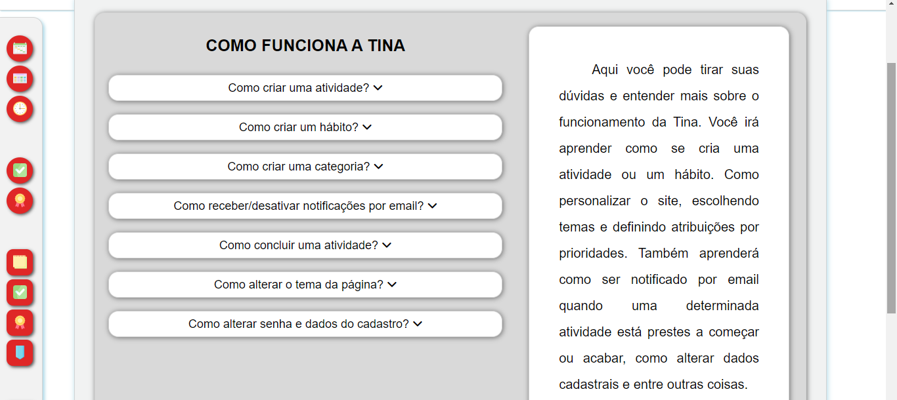
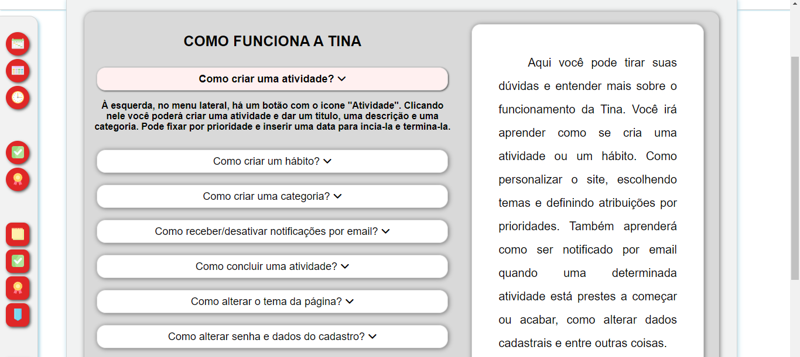
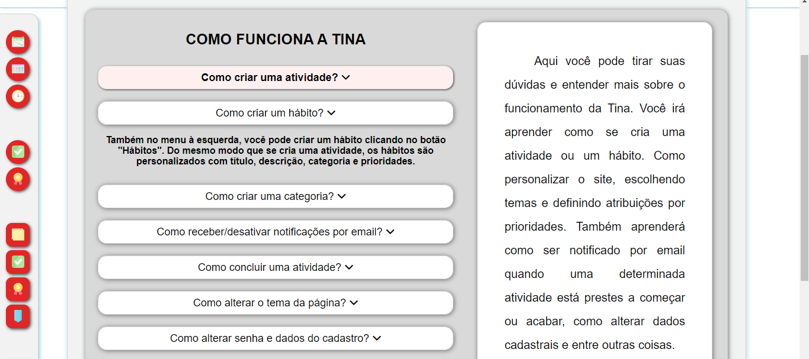
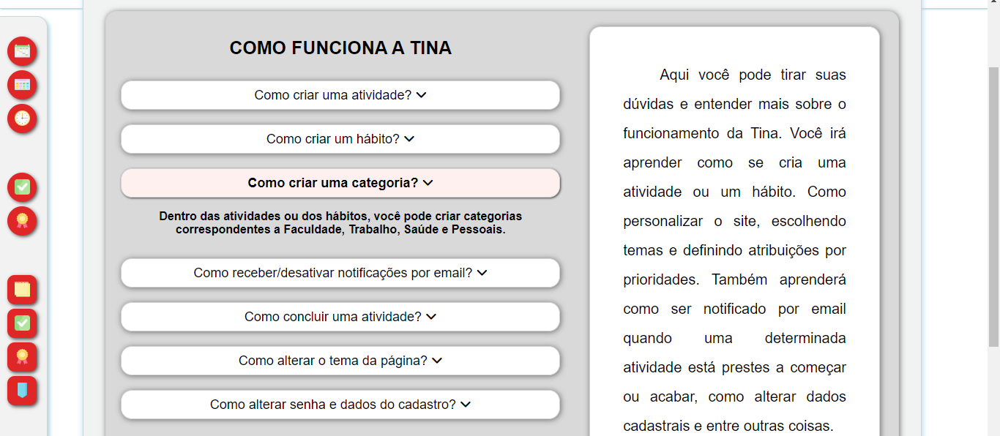
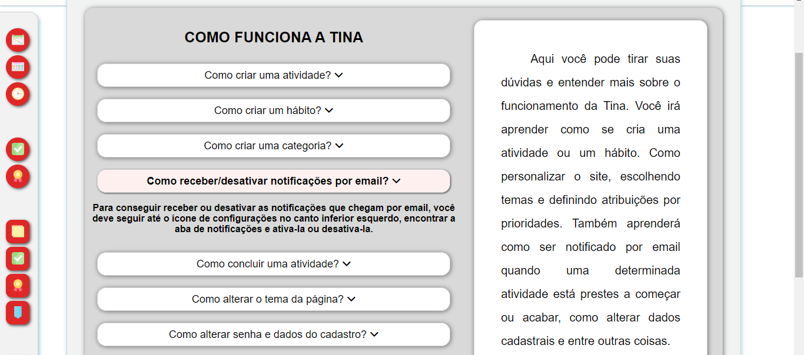
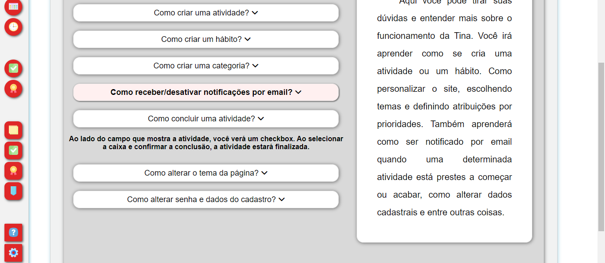
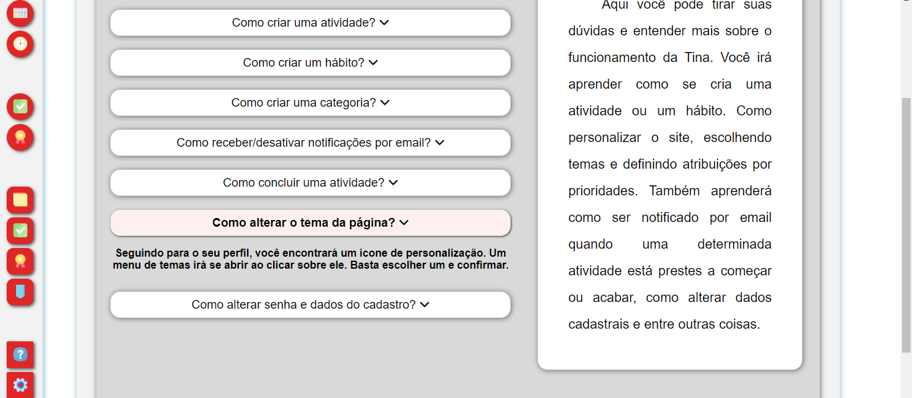
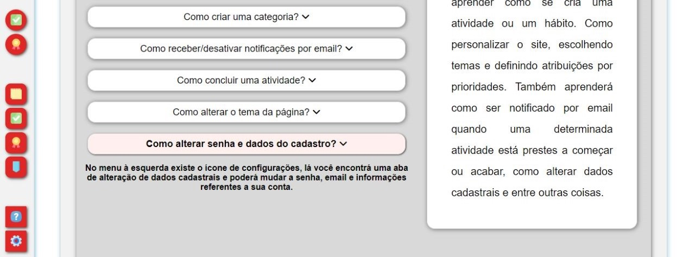

## Requisitos atendidos
Funcionalidade sem requisitos específicos


### Artefatos da funcionalidade

- tela.duvidas.html
- tela.duvidas.css
- tela.duvidas.js
- favicon.ico
- /Images

```js
var container = document.getElementById("resposta-1");
var button = document.getElementById("action-btn");

button.addEventListener("click", function() {
  
  var container = document.getElementById("resposta-1");

  if(container.style.display === "block") {
    container.style.display = "none";
  } else {
    container.style.display = "block";

  }

});


var container2 = document.getElementById("resposta-2");
var button = document.getElementById("action-btn2");

button.addEventListener("click", function() {
  
  var container = document.getElementById("resposta-2");

  if(container.style.display === "block") {
    container.style.display = "none";
  } else {
    container.style.display = "block";

  }

});

var container2 = document.getElementById("resposta-3");
var button = document.getElementById("action-btn3");

button.addEventListener("click", function() {
  
  var container = document.getElementById("resposta-3");

  if(container.style.display === "block") {
    container.style.display = "none";
  } else {
    container.style.display = "block";

  }

});


var container2 = document.getElementById("resposta-4");
var button = document.getElementById("action-btn4");

button.addEventListener("click", function() {
  
  var container = document.getElementById("resposta-4");

  if(container.style.display === "block") {
    container.style.display = "none";
  } else {
    container.style.display = "block";

  }

});

var container2 = document.getElementById("resposta-5");
var button = document.getElementById("action-btn5");

button.addEventListener("click", function() {
  
  var container = document.getElementById("resposta-5");

  if(container.style.display === "block") {
    container.style.display = "none";
  } else {
    container.style.display = "block";

  }

});

var container2 = document.getElementById("resposta-6");
var button = document.getElementById("action-btn6");

button.addEventListener("click", function() {
  
  var container = document.getElementById("resposta-6");

  if(container.style.display === "block") {
    container.style.display = "none";
  } else {
    container.style.display = "block";

  }

});

var container2 = document.getElementById("resposta-7");
var button = document.getElementById("action-btn7");

button.addEventListener("click", function() {
  
  var container = document.getElementById("resposta-7");

  if(container.style.display === "block") {
    container.style.display = "none";
  } else {
    container.style.display = "block";

  }

}); 
```


