# Registro de Testes de Software

Com base nas funcionalidades, requisitos e casos de testes propostos no item anterior (08. Plano de Testes de Software) os registros dos testes são descritos a seguir:

| Caso de Teste | CT-01 - Criação de atividade |
|---------------|--------------------------|
| Requisitos Associados | RF-01 - O site deve permitir que o usuário crie atividades, associe os cadastros a unidades de tempo no calendário e os classifique quanto à categoria e nível de prioridade. |
| Objetivo do Teste | Verificar se a criação de atividade é realizada de maneira correta, com as validações e armazenamento no LocalStorage |
| Passos | 1) Abrir o navegador 2) Acessar o site 3) Após o login, acessar o modal de criação de atividade interagindo com o botão de criar atividade no menu lateral esquerdo 4) No modal, inserir nos campos do formulário as informações sobre a atividade a ser criada 5) Selecionar o botão "Criar" |
| Critérios de Êxito | - O modal de criação de atividade deve abrir corretamente e com os campos vazios - O campo de data final e horário final devem estar inativos e só serão habilitados após o campo data inicial e horário inicial serem preenchidos com valores válidos. O campo de data inicial deverá apresentar como valor mínimo para seleção a data atual, impossibilitando o usuário de selecionar datas anteriores. Por sua vez, o campo de data final deverá apresentar como valor mínimo para seleção a data utilizada no campo data inicial. Ao tentar criar uma atividade sem preencher algum dos campos, o campo vazio deverá apresentar contorno vermelho e a atividade não deverá ser criada. Ao tentar criar atividade com título já utilizado, uma mensagem de alerta deverá ser apresentada ao usuário, indicando que já existe atividade com o título escolhido. Ao finalizar a criação, a atividade deverá ser visualizada no calendário, apresentando a cor de sua categoria e disposição compatível com a periodização selecionada pelo usuário. |
| Print dos Testes | 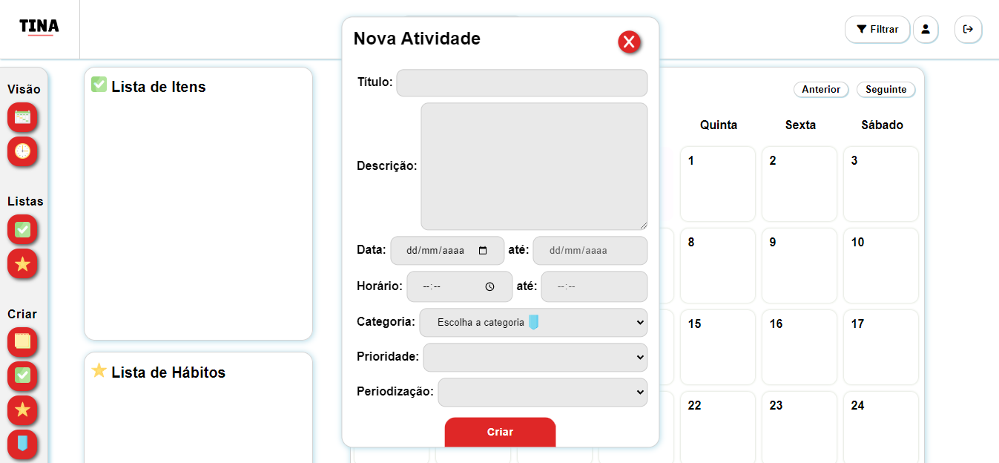 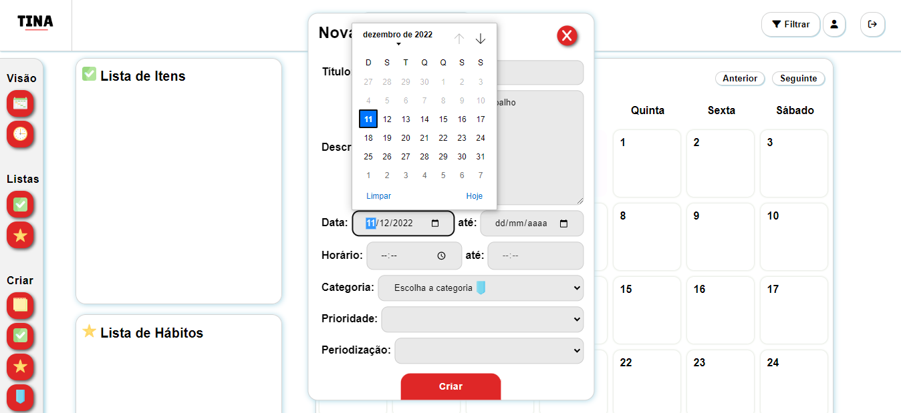 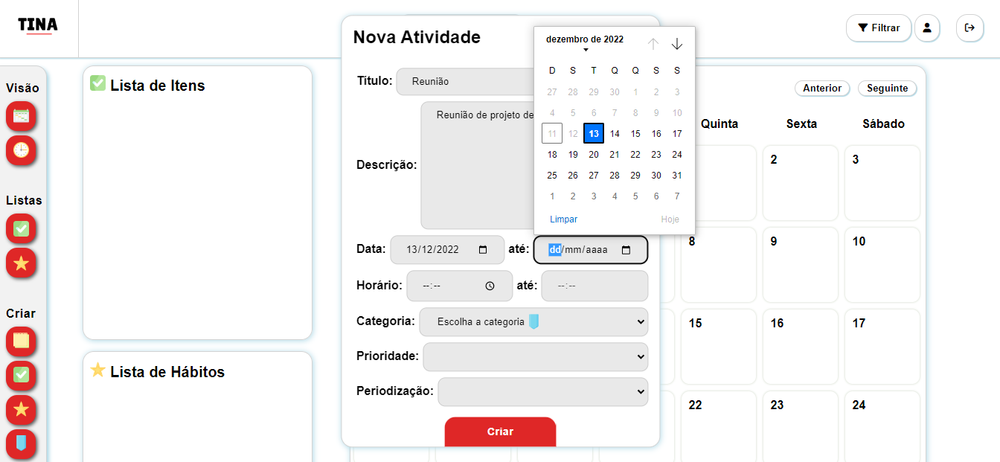 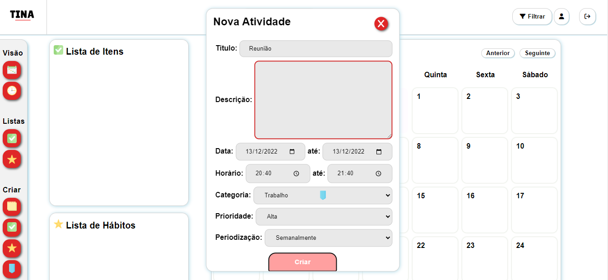 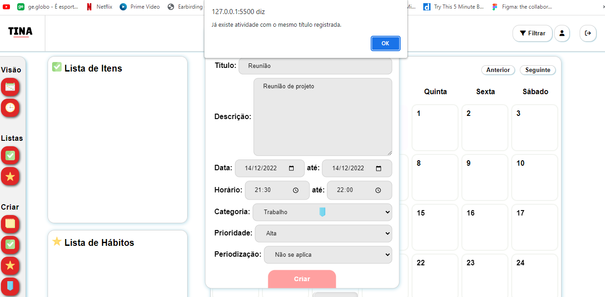 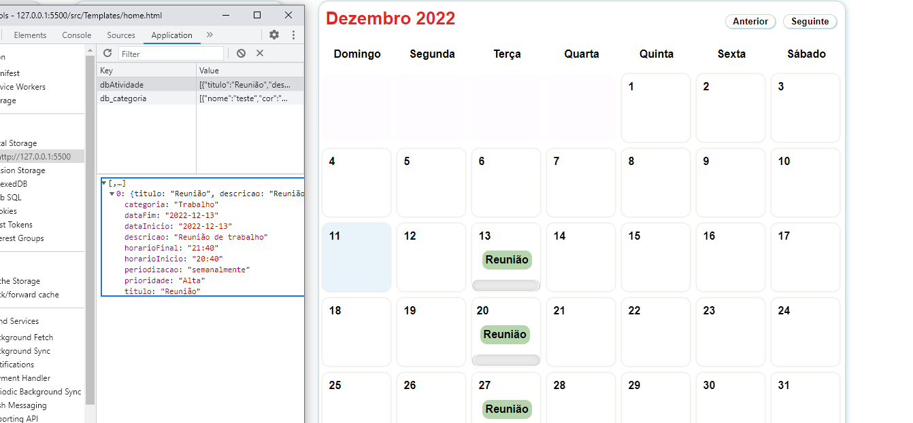 |
| Conclusão do teste | Teste realizado com sucesso. Após inserir os dados corretamente, a atividade é criada e apresentada no calendário. |

| Caso de Teste | CT-02 - Editar e Excluir Atividade |
|---------------|--------------------------|
| Requisitos Associados | RF-04 - O site deve permitir que as atividades sejam editadas, inclusive entre as unidades de tempo no calendário. RF-05 - O site deve permitir que o usuário sinalize uma atividade como finalizada ou cancelada. |
| Objetivo do Teste | Verificar se a edição e exclusão de atividades são realizadas da maneira correta, com as validações e armazenamento ou exclusão no LocalStorage |
| Passos | 1) Abrir o navegador 2) Acessar o site 3) Na página inicial selecionar a atividade que se deseja atualizar ou excluir no calendário 4) No modal de edição de atividade, inserir nos campos do formulário as informações para a atualização da atividade 5) Selecionar o botão "Atualizar" para atualizar a atividade com os novos dados, ou "Excluir" para apagar a atividade. |
| Critérios de Êxito | - O modal de edição de atividade deve abrir corretamente, ao selecionar uma atividade no calendário. - Todos os campos devem estar preenchidos corretamente com os dados da atividade selecionada - Ao inserir as informações do formulário, deve ser informado se todos os campos foram preenchidos, caso contrário, os campos ficarão com as bordas em vermelho e a atividade não será atualizada. - Caso o título informado já tenha sido associado a uma atividade já criada, um alerta será exibido pelo browser, a menos que o título da atividade selecionada não seja alterado, indicando que a atividade já existente é a mesma que se deseja atualizar. - Ao clicar no ícone para fechar o modal, o mesmo deve ser recolhido. - Ao abrir novamente o modal, os campos deverão estar preenchidos de acordo com a atividade selecionada. - Ao finalizar a edição da atividade, um novo modal que eventualmente for aberto, também deverá possuir seus campos correspondentes à atividade selecionada. - Os "inputs" para data inicial e data final não deverão aceitar datas anteriores à data atual. - Após concluir a criação, um elemento, com o título da atividade, deve estar presente no calendário e associado corretamente ao dia inicial definido pelo usuário. - Mudanças de data deverão ser refletidas no calendário, com o elemento da atividade sempre posicionando-se de acordo com a data inicial selecionada pelo usuário. - Alterações no título também deverão ser visíveis no calendário. - Ao excluir uma atividade, uma mensagem de confirmação deve ser emitida pelo browser. - Caso a resposta seja positiva, a atividade não deverá mais aparecer no calendário. |
| Print dos Testes | 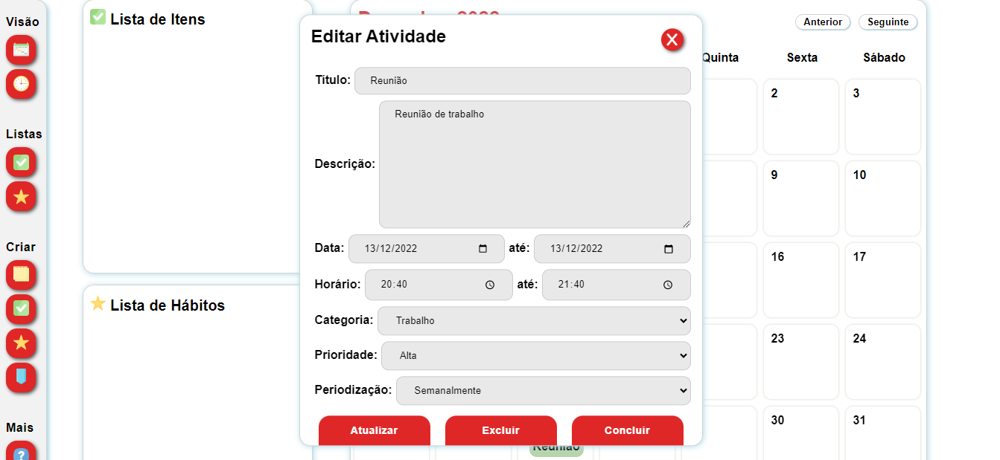 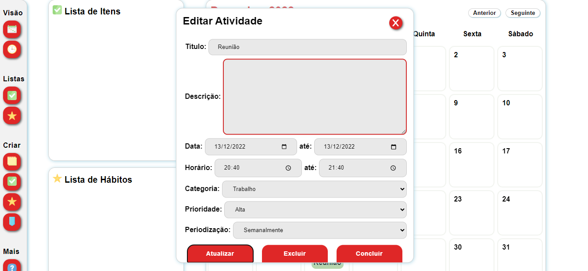 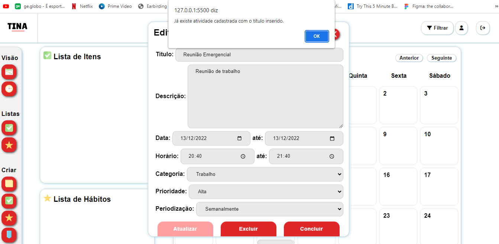 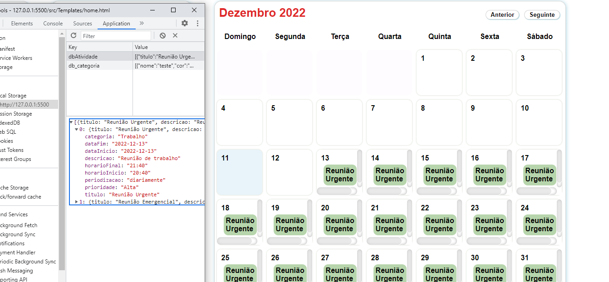 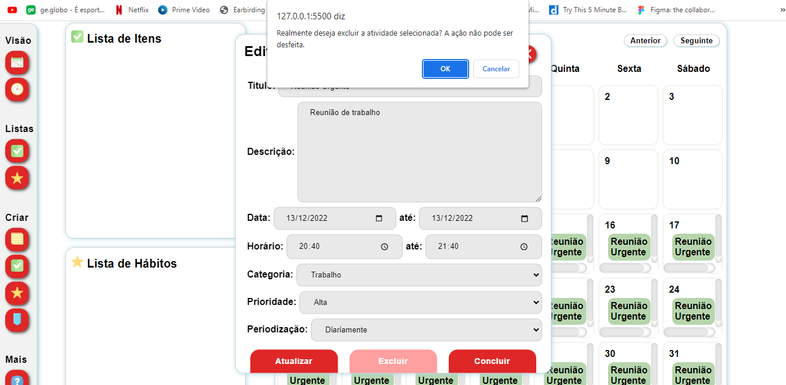 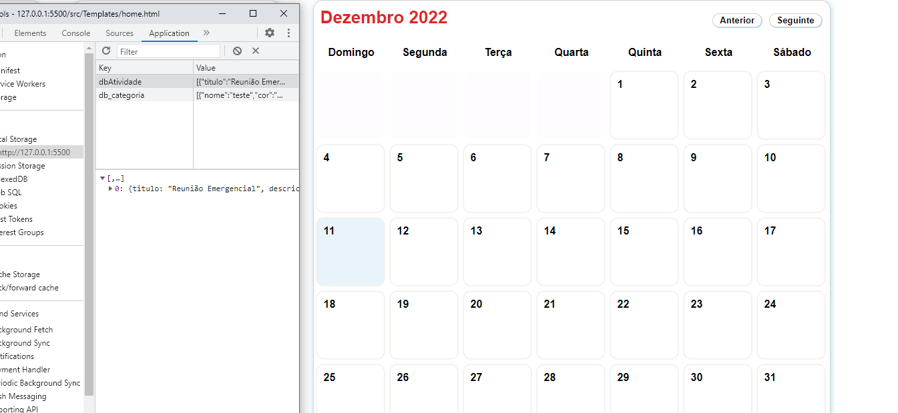 |
| Conclusão do teste | Teste realizado com sucesso. Após inserir os dados corretamente, a atividade é atualizada. Após confirmar desejo de exclusão, a atividade não é mais apresentada no calendário. |

| Caso de Teste | CT-03 - Cadastro no site |
|---------------|--------------------------|
| Requisitos Associados | RF-0 - Funcionalidade sem requisito em específico |
| Objetivo do Teste | Verificar se o cadastro é realizado da maneira correta, com as validações e armazenamento no LocalStorage |
| Passos | 1) Abrir o navegador 2) Acessar o site 3) Na página inicial selecionar "Cadastre-se" 4) Na tela de cadastro, inserir nos campos do formulário as informações para o cadastro 5) Selecionar o botão "Cadastrar" |
| Critérios de Êxito | - A tela de cadastro deve abrir corretamente - Ao inserir as informações do formulário, deve ser informado se os campos foram digitados corretamente, indicado pela cor verde, caso contrário, uma mensagem aparecerá em cada item do formulário em vermelho informando os critérios - Caso o usuário não preencha os campos ou deixe algum em branco, uma mensagem é exibida informando sobre o preenchimento - Caso o e-mail informado já tenha sido cadastrado uma mensagem é exibida sobre o ocorrido - Após todos os campos serem preenchidos corretamente deve abrir a caixa de texto informado que o usuário foi cadastrado |
| Print do Teste | 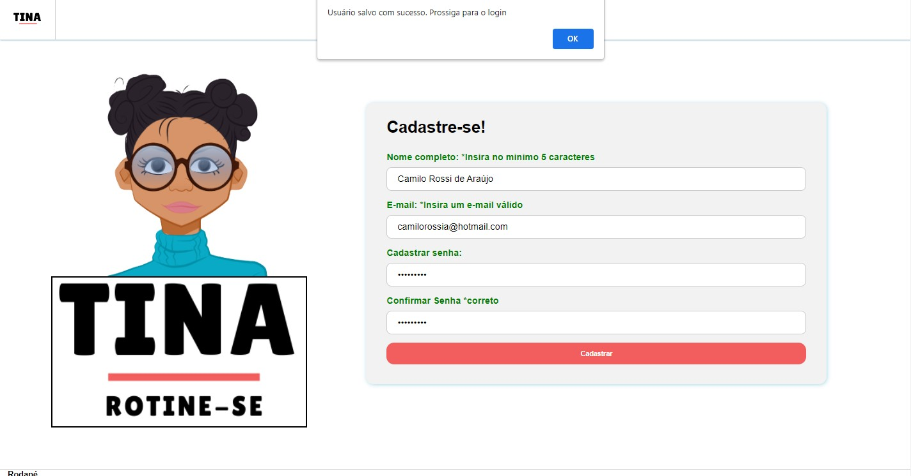  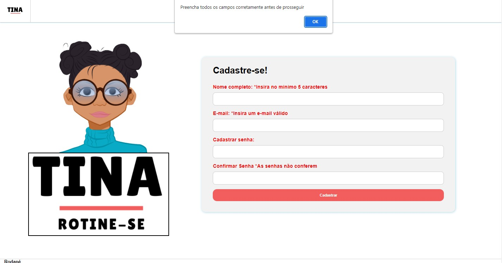|
| Conclusão do teste | Teste realizado com sucesso. Após inserir os dados corretamento com as validações o usuário é direcionado para o login e tem seus dados armazenados |

| Caso de Teste | CT-04 - Login |
|---------------|--------------------------|
| Requisitos Associados | RF-0 - Funcionalidade sem requisito em específico |
| Objetivo do Teste | Verificar se o login está ocorrendo corretamente |
| Passos | 1) Abrir o navegador 2) Acessar o site 3) Na página inicial inserir os dados de login 4) Selecionar o botão "entrar" |
| Critérios de Êxito | - A tela de login deve abrir corretamente - O login correto deve encaminhar o usuário para a plataforma do site - Ao digitar as informações erradas o usuário deve ser avisado por uma mensagem que os dados estão incorretos - O icone de visualização da senha deve exibir a senha ao ser selecionado |
| Print do Teste | 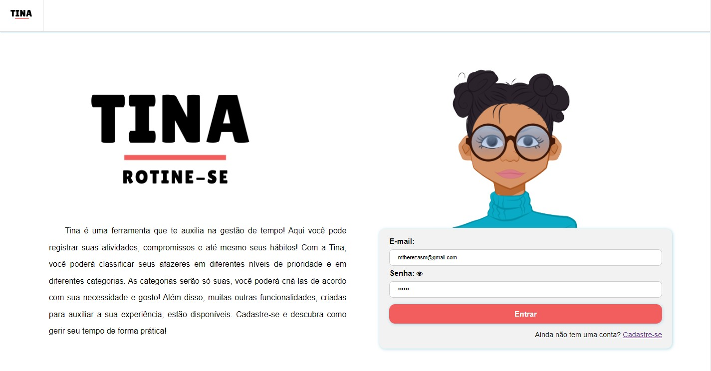 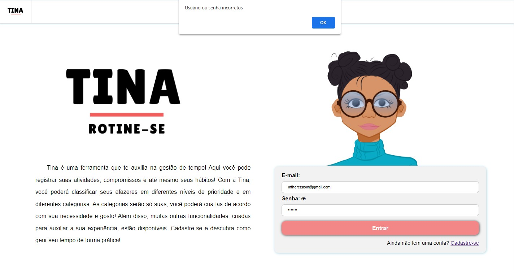 |
| Conclusão do teste | Teste realizado com sucesso. Após inserir os dados corretamento com as validações o login é realizado e o usuário é direcionado para a tela de perfil |

| Caso de Teste | CT-05 - Perfil|
|---------------|--------------------------|
| Requisitos Associados | RF-0 - Funcionalidade sem requisito em específico |
| Objetivo do Teste | Verificar o funcionamento correto da tela perfil |
| Passos | 1) Abrir o navegador 2) Acessar o site 3) Realizar o login 4) Selecionar o botão "entrar" 5) Ser direcionado para o Perfil |
| Critérios de Êxito | - A tela do Perfil deve abrir corretamente exibindo nome, e-mail e senha do usuário que realizou o login - Modificações no nome, e-mail ou senha do usuário devem ser alteradas corretamente no SessionStorage e LocalStorage |
| Print do Teste | 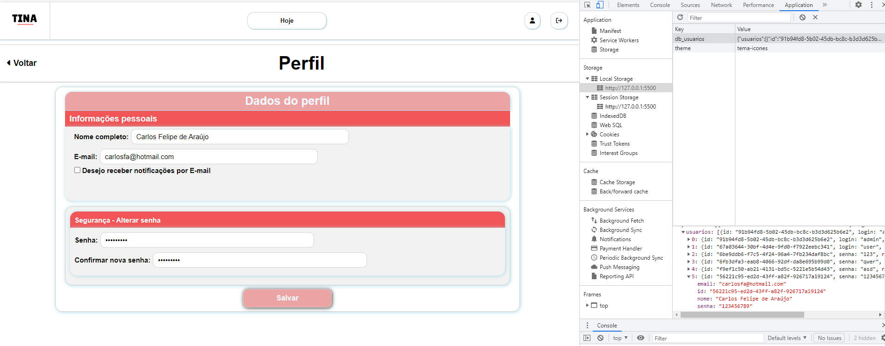 |
| Conclusão do teste | Teste realizado com sucesso. Após realizar o login o perfil é acessado exibindo os dados so usuário que realizou login e ao ser feita a modificação dos dados do cadastro há alteração correta dos campos modificados no SessionStorage e LocalStorage |

| Caso de Teste | CT-06 - Temas e estilização do site|
|---------------|--------------------------|
| Requisitos Associados | RF-11 - O site deve possibilitar edições de design como mudanças de cores, plano de fundo e adesivos |
| Objetivo do Teste | Verificar se a ferramenta de mudança do tema de cores e ícones do site está ocorrendo corretamente |
| Passos | 1) Abrir o navegador 2) Acessar o site 3) Acessar a página de estilização no menu ferramentas 4) Clicar no menu drop-down para exibir as opções de estilização 5) Selecionar o tema desejado | 
| Critérios de Êxito | - A tela de estilização deve abrir corretamente - O menu drop-down deve exibir os temas - O tema selecionado deve ser apliacado na página - A mudança de tema deve ocorrer caso seja selecionado outro tema. |
| Print do Teste | 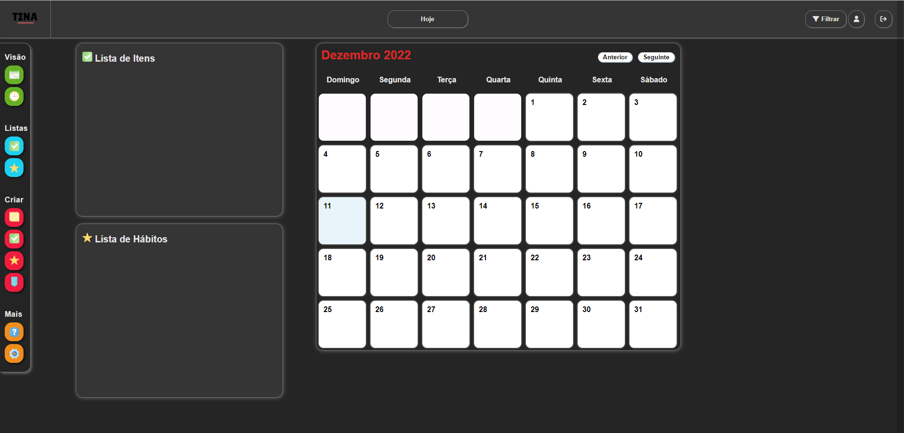 |
| Conclusão do teste | Teste realizado com sucesso. Ao selecionar a opção do tema, o site é estilizado para o tema escolhido|

| Caso de Teste | CT-08 - Parabenização |
|---------------|--------------------------|
| Requisitos Associados | RF-12 -O site parabeniza o usuário quando uma atividade é marcada como concluída antes do prazo. |
| Objetivo do Teste | Verificar se a parabenização por concluir uma atividade antes da data final definida é realizada da maneira correta |
| Passos | 1) Abrir o navegador 2) Acessar o site 3) Na página, no calendário, selecionar a atividade que se deseja concluir 4) No modal de edição de atividade, selecionar o botão "Concluir" | 
| Critérios de Êxito | - O modal de edição de atividade deve abrir corretamente - Ao selecionar acionar o botão "Concluir", um áudio deverá ser reproduzido pelo browser e a atividade devera desaparecer do calendário e ser excluída do Local Storage. |
| Print do Teste | 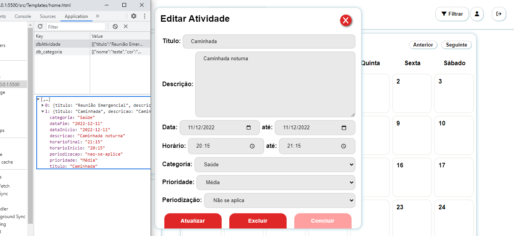 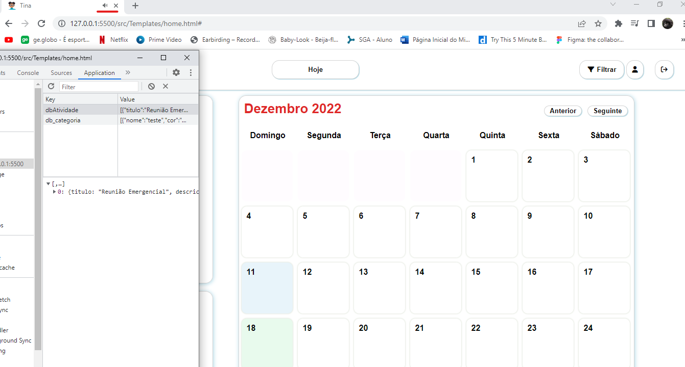 |
| Conclusão do teste | Teste realizado com sucesso. Ao selecionar "Concluir", a atividade não é mais apresentada no calendário e é excluída do Local Storage. O áudio de parabenização é executado pelo navegador |
