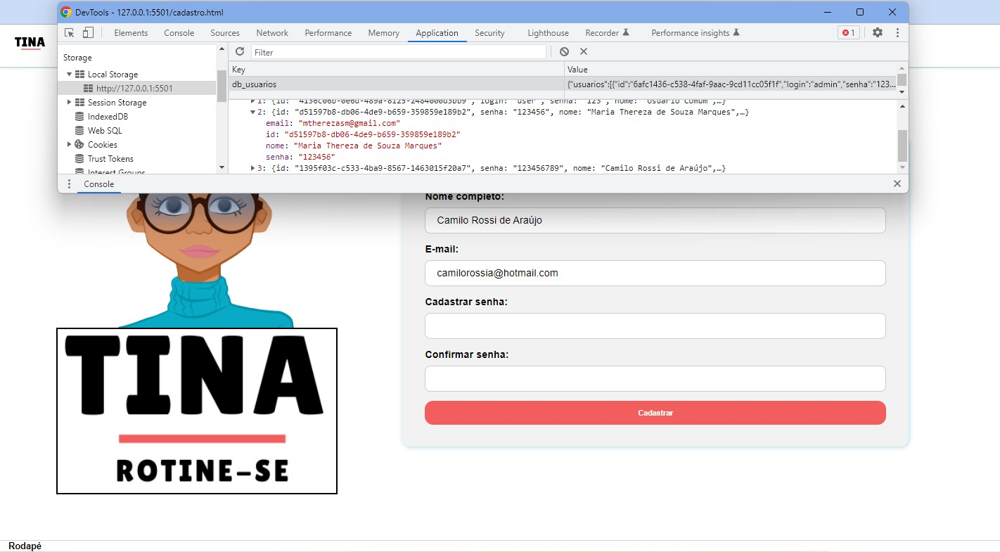

# Registro de Testes de Software

Com base nsa funcionalidades, requisitos e casos de testes propostos no item anterior (08. Plano de Testes de Software) os registros dos testes são descritos a seguir: 

| Caso de Teste | CT-01 - Cadastro no site |
|---------------|--------------------------|
| Requisitos Associados | RF-0 - Funcionalidade sem requisito em específico |
| Objetivo do Teste | Verificar se o cadastro é realizado da maneira correta, com as validações e armazenamento no LocalStorage |
| Passos | 1) Abrir o navegador 2) Acessar o site 3) Na página inicial selecionar "Cadastre-se" 4) Na tela de cadastro, inserir nos campos do formulário as informações para o cadastro 5) Selecionar o botão "Cadastrar" |
| Critérios de Êxito | - A tela de cadastro deve abrir corretamente - Ao inserir as informações do formulário, deve ser informado se os campos foram digitados corretamente, indicado pela cor verde, caso contrário, uma mensagem aparecerá em cada item do formulário em vermelho informando os critérios - Caso o usuário não preencha os campos ou deixe algum em branco, uma mensagem é exibida informando sobre o preenchimento - Caso o e-mail informado já tenha sido cadastrado uma mensagem é exibida sobre o ocorrido - Após todos os campos serem preenchidos corretamente deve abrir a caixa de texto informado que o usuário foi cadastrado |
| Print do Teste |   |
| Conclusão do teste | Teste realizado com sucesso. Após inserir os dados corretamento com as validações o usuário é direcionado para o login e tem seus dados armazenados |

| Caso de Teste | CT-02 - Login |
|---------------|--------------------------|
| Requisitos Associados | RF-0 - Funcionalidade sem requisito em específico |
| Objetivo do Teste | Verificar se o login está ocorrendo corretamente |
| Critérios de Êxito | - A tela de login deve abrir corretamente - O login correto deve encaminhar o usuário para a plataforma do site - Ao digitar as informações erradas o usuário deve ser avisado por uma mensagem que os dados estão incorretos - O icone de visualização da senha deve exibir a senha ao ser selecionado |
| Print do Teste | ... |
| Conclusão do teste | ... |

| Caso de Teste | CT-03 - Perfil|
|---------------|--------------------------|
| Requisitos Associados | RF-0 - Funcionalidade sem requisito em específico |
| Objetivo do Teste | Verificar o funcionamento correto da tela perfil |
| Critérios de Êxito | - A tela do Perfil deve abrir corretamente exibindo nome e e-mail do usuário que realizou o login - Ao inserir uma foto e clicar em salvar, a imagem selecionada deve ser exibida no campo foto |
| Print do Teste | ... |
| Conclusão do teste | ... |

| Caso de Teste | CT-04 - Temas e estilização do site|
|---------------|--------------------------|
| Requisitos Associados | RF-11 - O site deve possibilitar edições de design como mudanças de cores, plano de fundo e adesivos |
| Objetivo do Teste | Verificar se a ferramenta de mudança do tema de cores e ícones do site está ocorrendo corretamente |
| Critérios de Êxito | - A tela de estilização deve abrir corretamente - O menu drop-down deve exibir os temas - O tema selecionado deve ser apliacado na página - A mudança de tema deve ocorrer caso seja selecionado outro tema. |
| Print do Teste | ... |
| Conclusão do teste | ... |
